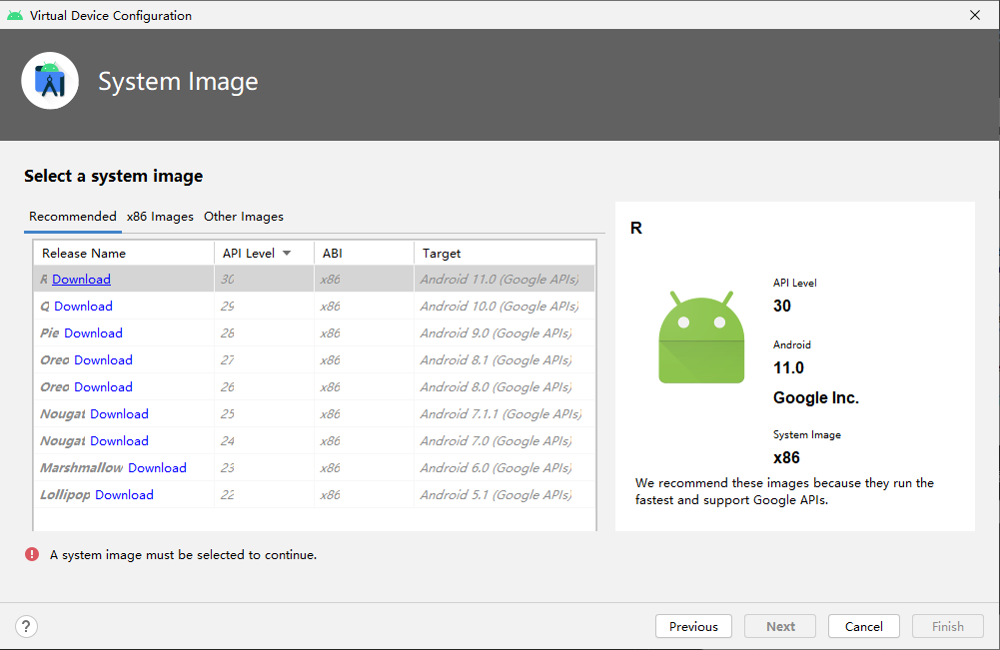
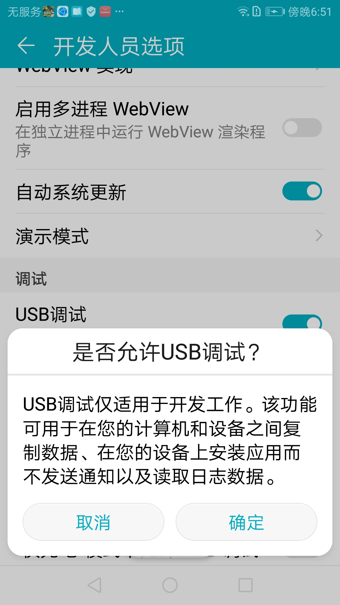

当今大部分手机都是Android手机，市场占有率远远超过苹果手机。Android操作系统不仅在手机领域，在平板、手表、电视、汽车、智能硬件和物联网开发等领域也有广泛的使用。本课程以手机为主讲解android应用的开发。

学习Android应用开发，我们首先要记住一个网址 https://developer.android.google.cn/ ，如果觉得这个网址过长的话，也可以直接访问 https://developers.google.cn/ ，这里除了可以学习android，还可以学习人工智能平台TensorFlow。

在开发Android应用之前，需要搭建开发环境。首先要下载安装Android Studio， 该软件的下载地址是：
https://developer.android.google.cn/studio 。根据操作系统的不同选择相应的版本，Android Studio支持Windows，Mac，Linux，Chrome OS。后面的讲解以Windows下为准，使用其他系统的同学遇到问题，可以私信我解决，我QQ：67522134 。加我好友时要说明你是谁，问问题直接问即可，不需要礼貌性的问“在吗”。

有个建议给使用Windows系统的同学，系统盘建议至少100GB以上，多多益善。很多同学因为系统盘紧张，花费了大量的时间在清理磁盘移动安装文件等，这些都是得不偿失的。现在大部分同学的而机器配置还是可以的，一般至少有个固态盘了，如果没有固态盘的，建议买一个200G及以上的作为系统盘，可以大大提升电脑的性能。你要记住时间是最宝贵的， 很多人在不断的“服侍”机器中，浪费青春年华，失去了学习计算机的乐趣。

下面我们来正式开始安装和配置

1. 安装Android Studio

双击下载的安装包，出现如图界面

建议下面的虚拟设备也打勾，因为并不是所有的同学都有android手机来进行运行调试，如果是其他设备，可能就更少了，使用模拟器可以在pc中虚拟一个手机出来，很方便。不足之处是，虚拟出来的设备会消耗一定的机器资源，对大家的电脑是个考验，首先需要开启虚拟化的支持，一般是没有问题的，没有设置支持的，进入BIOS设置一下即可。

然后我们点击下一步，进入如图界面

这里就要注意，如果你的系统盘空间不足的话，就把C改成其它有空间的盘吧，比如D。空间够的同学就很爽了，直接下一步即可。

这里开始正式安装了，安装完成后，会出现如图界面。

勾选后，点Finish，进入如图界面，说明我们Android Studio已经安装好了，可以使用了

在这个欢迎界面中

Create New Project:创建工程

Open an Existing Project:打开工程

Get from Version Control:从版本控制工具获取，比如git或github

Profile or Debug APK:对现有apk进行性能分析和调试，APK是Android application package的缩写，即Android安装包(apk)

Import Project:导入其它系统创建的项目

Import an Android Code Sample:可以导入一些例子，内地的同学可能会上不了。

右下角还有两个按钮

Configure：配置，下一节详细讲解

Get Help:获取帮助，一般是英文的，大家也看不了，大家想学习的话，可以从 https://developer.android.google.cn/docs 这个入口进入

2. Android Studio 配置

在欢迎界面的右下角点击Configure进入如图节目

大家会看到很多配置入口，首先选择SDK Manager，进入如图节目。

Android的SDK是Android的软件开发工具包，里面包含各种库和工具，如果你要开发的平台版本比较多，那么占用空间会比较大，对于空间不够的同学，建议点击”Edit“修改SDK的默认目录。在下面SDK Platforms里面我选了一个Android 11和Android 8，前者比较新，后者正好和我手机的版本匹配，各位同学可以直接选择最新的11即可。

这个界面其实不只是配置Android SDK，常见的配置还有外观，点击上方的 Appearance，会出现如下界面。

在Theme的下拉框可以选择喜欢的外观，喜欢亮的就选IntelliJ Light，喜欢暗的就选Darcula，喜欢对比度高的就选择High contrast。我这里为了上课投影看的清楚，我选择了亮的。然后点击ok就可以了。SDK的下载安装可能需要些时间，但没办法这关还是要过。实在不行，可以使用科学上网，仅限于学习还是没有问题的。

需要用模拟器的同学还需要进行AVD Manager的配置，点击AVD Manager进入如下界面。

从图中可以选择多种类型的设备，比如手机，手表，电视，汽车，智能设备等。我们点击Create Virtual Device，出现如下截面。

在图中，选择Phone，选择一个分辨率比较高的手机 Pixel 4 XL，说不定还可以用来吃鸡。点击下一步。

在图中，我们选择下载系统推荐的最新的Android R版本的x86镜像，因为我的电脑cpu就是x86架构，速度会快一些的，如果用苹果M1的同学，应该选择arm。在R后点击Download。

需要下载1.2G，要好一会儿了。完成后点击Finish。然后上图一直下一步，知道Finish，后出现设备的管理器，如图所示。

在这个界面中，我们还可以创建多个手机或者其他设备，只要你机器上面的空间足够，这些镜像也是挺占用空间的。所以大家知道系统盘空间大的好处了吧，不然你会“与天斗与地斗，遍体鳞伤”。点击Actions下的运行按钮（三角形），可以打开一个模拟的手机。如图所示。

右边有个工具条，可以进行各种操作，大家有兴趣可以探索一下可以做些什么。这个虚拟设备共享了主机的网络，也可以上网。

这里有个问题一定要注意，如果你的用户不是英文的话，会造成模拟手机不能运行。所以我们首先要删掉这个模拟手机，然后要在某个纯英文的目录下建立一个目录avd，最好是sdk目录下，便于管理。然后设置环境变量Android_SDK_HOME，值为这个avd目录。然后关闭Android Studio 后重新打开，然后重新进入avd设置即可。

3. 第一个android程序

在欢迎界面中，我们点击Create New Project创建第一个工程。如图所示。

选择一个比较常见的模板Bottom Navigation Activity，点击Next。

在这个界面中，给应用取个名字，我是MyFirstApp，包名pub.renge.myfirstapp。（renge.pub是我的域名，一般包名开头用倒过来的域名表示，可以实现唯一性，这是java里面第三方库中包命名的普遍做法）。路径可以自己选择，如果系统盘空间不够的话，就换一个比较大的地方。语言选择Java，当然你也可以选择Lotlin。Kotlin 是一种新型的静态类型编程语言，有超过 60% 的专业 Android 开发者在使用，它有助于提高工作效率、开发者满意度和代码安全性。这么课程中，大家有兴趣也可以选择，很多同学怕没有学过怎么办，没关系，我也没有学习过，干就是了。最后是选择最低支持的SDK，我选了Oreo。下面自动会提示大概有多少设备支持。如果你想你的app支持更多的设备，那就要调低版本。我们目前的学习来说，默认就好。点击Finish。会进入程序设计的界面。

第一次出现这个界面的时候，还是有些慢的，有点耐心，等底下状态栏显示任务ok的时候，我们可以点击上方的运行按钮，运行成功之后，就可以在模拟器中看到我们自己的app在运行了。如图所示。

点击下方的按钮可以切换界面，至此我们不写一行代码，第一个程序跑出来了。

如果有同学想在自己的手机跑这个程序，首先要找根数据线，连接电脑和手机，然后进入手机的开发者模式。不同手机进入开发者模式的方式不太一样，大家可以自行搜索，下面以我的华为荣耀8青春版为例，来讲解如何进入开发者模式。

首先，手机进入设置。如图所示。

进入关于手机。如图所示。

然后不停的点击版本号，就会弹出一个提示框，表示开启了“开发者模式”。回到“系统”会发现多了个“开发者选项”，如图所示。

点击“开发人员选项”，进入设置。

点击“允许USB调试”，出现弹框，如果出现的是上图这个样子不是指纹信息，说明驱动没有安装好，这时候需要去华为官网下载手机助手，安装好即可，然后卸载了都没有问题。再次“允许USB调试”时，就是弹出如下界面。

勾选“始终允许”，然后确定。这时在Android Studio主界面上方会发现多出了一个设备。如图所示。

点击运行，然后Android Studio会在手机上安装我们的第一个App。在手机上一路允许，最终会看到第一个程序出现了。