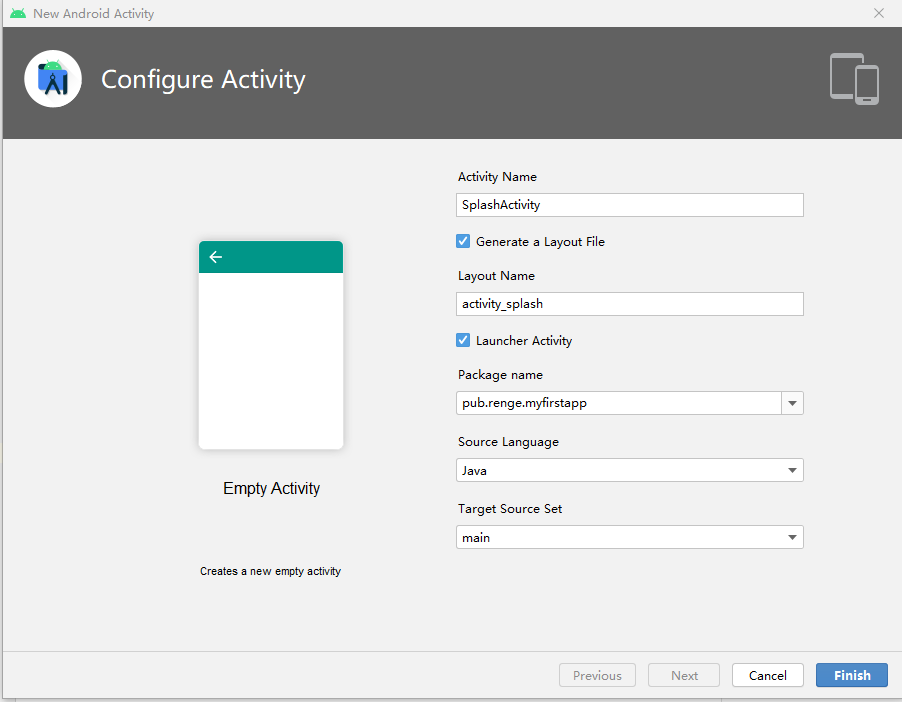
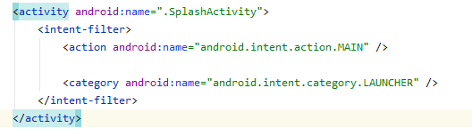
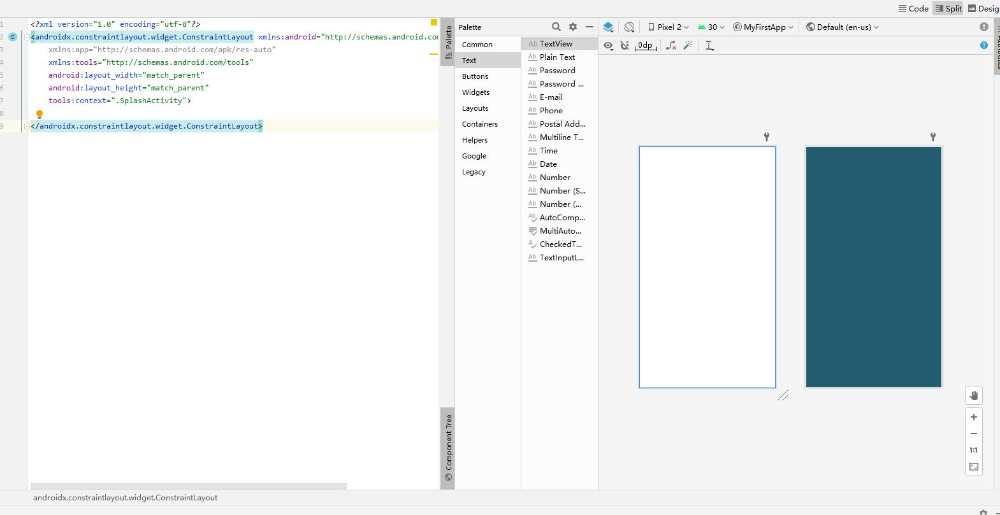
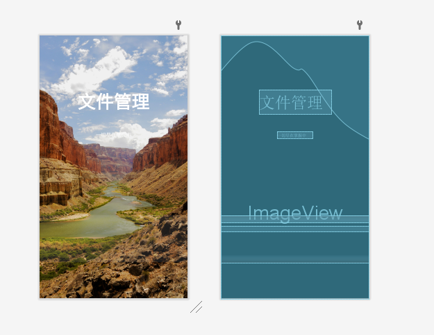
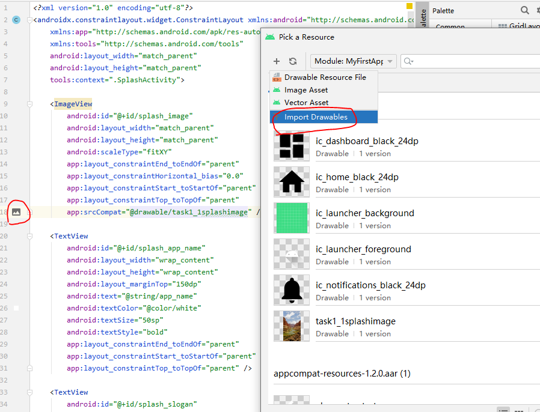
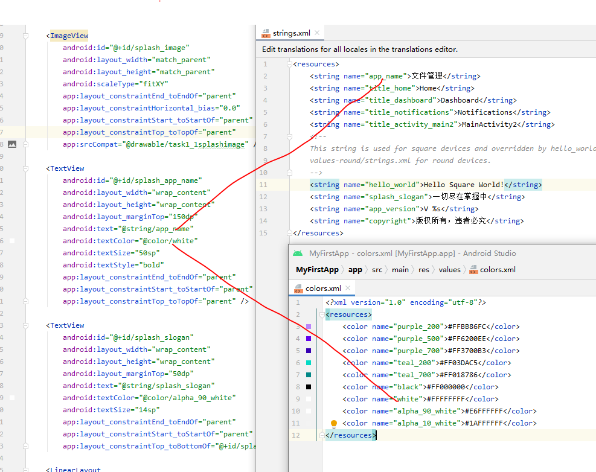
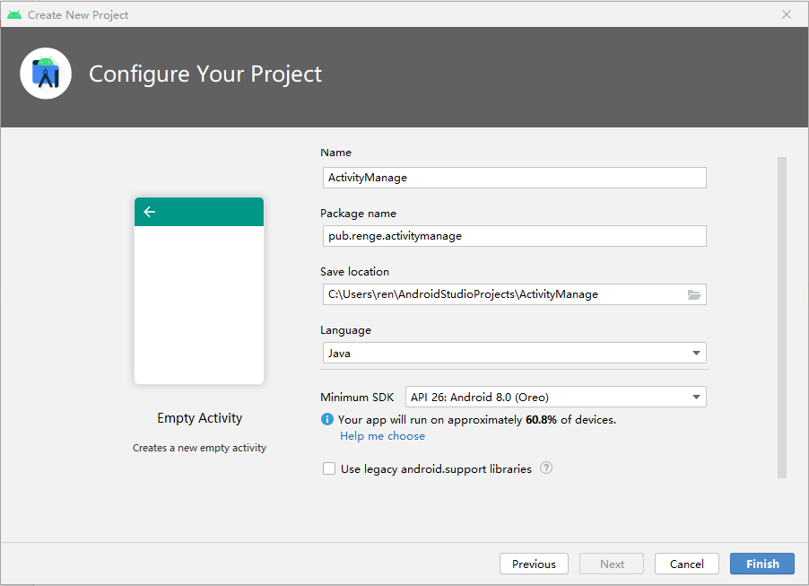
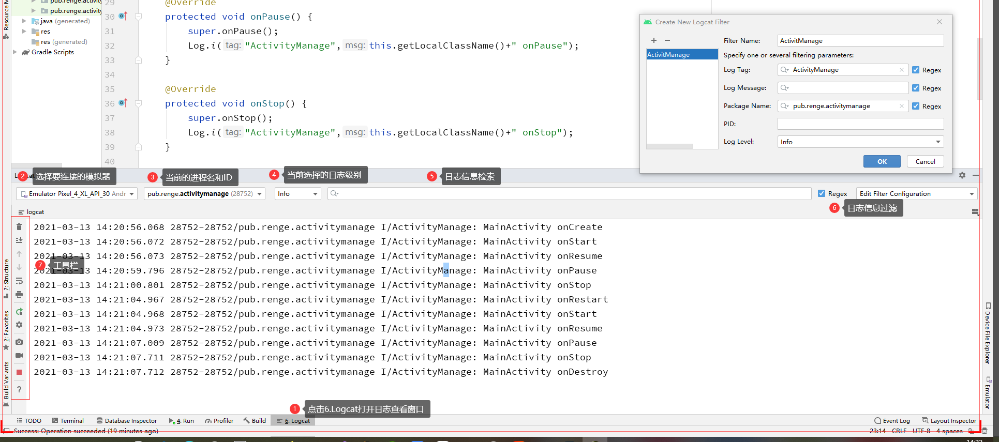

## task1 Activity创建与管理-Splash

在Android中，Activity是四大组件之一，主要用于显示界面和用户进行交互。首先，我们从简单的界面开始，比如闪屏界面。闪屏可以让应用打开比较自然，不是突然进入应用内部，而是出现一个图片，让你在等待的过程中不那么无聊。系统也可以在闪屏的同时加载资源或者播放广告。下面我们在我们的第一个程序上面创建一个闪频，效果是程序打开3s后跳转到原来的主界面。

###  创建闪频Activity

右键左边栏中任何位置New->Activity->Empty Activity，出现创建Activity对话框，如图所示。



设置Activity Name为SplashActivity。勾选Generate a Layout File，这样系统会在res->layout下生成一个布局文件。Layout Name默认为activity_splash。然后勾选Launcher Activity，表示app启动时首先运行SplashActivity。后面的都默认，点击Finish。

系统自动在AndroidManifest.xml中加入下面一节activity配置，表示从SplashActivity启动。如图所示。



系统在java->pub.renge.myfirstapp下自动生成了SplashActivity.java文件，我们可以在这个文件中编写程序设置闪屏几秒中，下一个屏幕是什么。

系统在res->layout下自动生成activity_splash.xml配置文件，在这里可以设置闪屏的界面。

### 修改闪频布局

activity_splash.xml文件以xml文件保存布局样式，编辑方式有两种，代码模式和设计模式。如果所示，左边是代码，纯文本，右边是设计器，拖拽的模式，所见即所得，这是一种文件的两种不同编辑方式而已，最终还是文本文件的方式保存。



具体文件内容如下：

```xml
<?xml version="1.0" encoding="utf-8"?>
<androidx.constraintlayout.widget.ConstraintLayout xmlns:android="http://schemas.android.com/apk/res/android"
    xmlns:app="http://schemas.android.com/apk/res-auto"
    xmlns:tools="http://schemas.android.com/tools"
    android:layout_width="match_parent"
    android:layout_height="match_parent"
    tools:context=".SplashActivity">

    <ImageView
        android:id="@+id/splash_image"
        android:layout_width="match_parent"
        android:layout_height="match_parent"
        android:scaleType="fitXY"
        app:layout_constraintEnd_toEndOf="parent"
        app:layout_constraintHorizontal_bias="0.0"
        app:layout_constraintStart_toStartOf="parent"
        app:layout_constraintTop_toTopOf="parent"
        app:srcCompat="@drawable/task1_1splashimage" />

    <TextView
        android:id="@+id/splash_app_name"
        android:layout_width="wrap_content"
        android:layout_height="wrap_content"
        android:layout_marginTop="150dp"
        android:text="@string/app_name"
        android:textColor="@color/white"
        android:textSize="50sp"
        android:textStyle="bold"
        app:layout_constraintEnd_toEndOf="parent"
        app:layout_constraintStart_toStartOf="parent"
        app:layout_constraintTop_toTopOf="parent" />

    <TextView
        android:id="@+id/splash_slogan"
        android:layout_width="wrap_content"
        android:layout_height="wrap_content"
        android:layout_marginTop="50dp"
        android:text="@string/splash_slogan"
        android:textColor="@color/alpha_90_white"
        android:textSize="14sp"
        app:layout_constraintEnd_toEndOf="parent"
        app:layout_constraintStart_toStartOf="parent"
        app:layout_constraintTop_toBottomOf="@+id/splash_app_name" />

    <LinearLayout
        android:layout_width="match_parent"
        android:layout_height="match_parent"
        android:layout_marginTop="500dp"
        android:layout_marginBottom="100dp"
        android:background="@color/alpha_10_white"
        android:orientation="vertical"
        android:visibility="visible"
        app:layout_constraintBottom_toBottomOf="parent"
        app:layout_constraintEnd_toEndOf="parent"
        app:layout_constraintStart_toStartOf="parent"
        app:layout_constraintTop_toBottomOf="@+id/splash_slogan"
        >

        <TextView
            android:id="@+id/splash_version_name"
            android:layout_width="match_parent"
            android:layout_height="wrap_content"
            android:gravity="center"
            android:textColor="@color/white"
            android:textSize="15sp" />

        <TextView
            android:id="@+id/splash_copyright"
            android:layout_width="match_parent"
            android:layout_height="wrap_content"
            android:layout_marginTop="10dp"
            android:gravity="center"
            android:textColor="@color/white"
            android:textSize="12sp" />

    </LinearLayout>


</androidx.constraintlayout.widget.ConstraintLayout>
```

设计效果如图所示，版本号和版权声明并没有填，这个主要是给大家演示下，如何用程序填写。



图片素材来自网络，大家可以自行搜索相关图片，然后把图片导入到res的drawable下，具体方法是点击图片中ImageView的左边栏选择图片标记，然后点击Import Drawables上传图片即可，记得xml文件中图片来源要和实际图片文件名称一致。



对于TextView控件的text和color属性，这里并没有写死，而是用一个常量来表示，比如@string/app_name,表示在strings.xml里面有个变量app_name可以设置，@color表示在colors.xml中设置颜色。这种方式可以很方便修改这些值。如图所示。




###　设置动画

在Android中动画也可以使用xml文件来表示，我们采用放大缩小并改变透明度的方式作为动画，每种效果2秒种，文件至于res的anim下，名称为splash.xml具体xml如下。

```
<?xml version="1.0" encoding="utf-8"?>
<set xmlns:android="http://schemas.android.com/apk/res/android">
    <scale android:fromXScale="2.0" android:toXScale="1.0"
        android:fromYScale="2.0" android:toYScale="1.0"
        android:pivotX="50%p" android:pivotY="50%p"
        android:duration="2000" />
    <scale android:fromXScale="1.0" android:toXScale=".5"
        android:fromYScale="1.0" android:toYScale=".5"
        android:pivotX="50%p" android:pivotY="50%p"
        android:duration="2000" />
    <alpha android:fromAlpha="1.0" android:toAlpha="0"
        android:duration="2000"/>
</set>
```

### 设置AndroidManifest.xml

这个文件中我们要修改splashactivity的配置为：

```
<activity android:name=".SplashActivity"
    android:theme="@style/Theme.AppCompat.NoActionBar"
    android:configChanges="keyboardHidden|orientation|screenSize"
    android:screenOrientation="portrait"
    >
    <intent-filter>
        <action android:name="android.intent.action.MAIN" />

        <category android:name="android.intent.category.LAUNCHER" />
    </intent-filter>
</activity>
```

NoActionBar表示没有工具栏，不然闪频显示个工具栏会很难看。

keyboardHidden表示隐藏键盘。

portrait表示方向是竖直的。

intent-filter 设为MAIN和LAUNCHER表示首先启动SplashActivity。

### 编写代码

前面资源和配置都差不多了，最后就是写代码。具体代码如下：

```
public class SplashActivity extends AppCompatActivity {
    private ImageView mSplashImage;
    private TextView mVersionName;
    private TextView mCopyRight;
    @Override
    protected void onCreate(Bundle savedInstanceState) {
        super.onCreate(savedInstanceState);
        setContentView(R.layout.activity_splash);

        mSplashImage = (ImageView)findViewById(R.id.splash_image);
        mVersionName = (TextView)findViewById(R.id.splash_version_name);
        mCopyRight = (TextView)findViewById(R.id.splash_copyright);

        mCopyRight.setText(getResources().getString(R.string.copyright));
        mVersionName.setText(getVersionName(getApplication()));

        Animation animation = AnimationUtils.loadAnimation(getApplicationContext(),R.anim.splash);

        animation.setAnimationListener(new Animation.AnimationListener() {
            @Override
            public void onAnimationStart(Animation animation) {

            }

            @Override
            public void onAnimationEnd(Animation animation) {
                Intent intent = new Intent(SplashActivity.this, MainActivity.class);
                startActivity(intent);
                finish();
            }

            @Override
            public void onAnimationRepeat(Animation animation) {

            }
        });

        mSplashImage.startAnimation(animation);
    }

    private String getVersionName(Context context) {
        String versionName = null;
        try {
            versionName = context.getPackageManager().getPackageInfo(context.getPackageName(),0).versionName;
        }catch (PackageManager.NameNotFoundException e){
            e.printStackTrace();
        }
        return String.format(context.getResources().getString(R.string.app_version),versionName);
    }
}
```


## task1.2  Activity管理-Activity生命周期

### Activity生命周期

当用户使用应用时，Activity实例会在其生命周期的不同状态之间进行转换，并提供很多回调方法，让你可以在状态变化时进行自己的处理。在Activity的状态切换过程中可能会出现各种问题，比如当用户不用时消耗系统的资源，当用户离开后并返回时丢失用户的进度，当屏幕横竖切换时奔溃和丢失数据。通过对生命周期的理解，我们要避免这种问题的发生。让Activity运行得更加流畅更加高效。Activity的整个生命周期如图所示。


on开头的方法都是状态发生变化时的回调方法，让我们可以通过这些方法来进行相关的处理。

onCreate：系统第一次创建Activity时，Activity进入Created状态，然后调用onCreate回调。在这个方法里面，可以写应用的初始设置，比如初始化资源，定义成员变量，设置布局，绑定数据等。此方法中还会接收savedInstanceState参数，用于恢复Activity被杀死前的状态。主要发生在App process killed ->onCreate()。当onCreate回调结束后，Activity马上进入Started状态。

onStart：Activity进入了Started状态时，系统会调onStart回调，我们可以在其中编写初始化UI的代码。onStart结束之后activity的状态马上就到Resumed状态。

onResume：Activity进入Resumed状态时，Activity会来到前台，然后调用onResume回调。在这个状态下，用户可以与应用可以交互，直到用户中断使用这个Activity，比如来电话，切换应用等。发生中断事件时，Activity进入*Paused*状态，调用onPause回调。如果用户又切换回这个Activity，那么Activity又会重新进入Resumed状态，并调用onResume回调方法。

onPause：Activity进入Paused装，系统会调用这个回调，说明用户离开了Activity，Activity已经不在前台出现，在多窗体界面中可能还是可以看到，或者有个新的半透明的Activity出现。虽然这些情况能看到Activity，但已经不是焦点了。由于Activity已经不在前台，我们在onPause里面可以停掉某些不必要再运行的功能，或者我们释放一些资源，比如对GPS等传感器的处理等。在多窗体情况下，可以不急着在onPause中释放所有资源或者调整UI资源，而要推迟到onStop回调中去处理。

onPause的时间比较短，不适合保存应用和数据。这些任务可能onPause结束了也没有结束。这些工作可以留到onStop里面做。

执行完onPause并不意味着Activity离开了Paused状态，比如当Activity恢复时，这时才真正离开Paused状态，进入Resumed状态。在这个过程中，Activity实例一直保存在内存中，所以进入Resumed状态后并不需要对之前初始化的内容再进行初始化。当Activity完全不可见时会离开Paused状态，进入Stoped状态。

onStop：当Activity对用户不可见时，Activity进入Stoped状态，系统会调用onStop回调。往往发生在一个新的Activity覆盖了整个屏幕，也可能是这个Activity确实要终止了。在onStop里面，我们应该释放和调整不需要的资源比如动画，还有执行CPU相对密集的关闭动作比如保存数据到数据库。在onStop里面而不在onPause里面释放UI资源，是因为onPause里面可能是一个多窗口环境。

Activity进入Stoped状态后，对象还是保留在内存中，只是不会附加到窗口管理器。当Activity恢复后，会重新使用这些信息，不需要重新初始化导致Resumed状态的回调中创建的组件。并且保持每个View对象的状态，你还可以看到之前在文本框写的内容。

在Stoped状态，当系统发现内存不够用时，可能会销毁这个Activity，保存View中信息在一个Bundle对象里面，如果用户切换回这个Activity，会通过这个Bundle恢复它们。当Activity从Stoped状态恢复，会调用onRestart回调。如果Activity从Stoped状态下结束运行，则会调用onDestroy回调。

onDestroy：当Activity被销毁前，要调用onDestroy回调，主要两个原因：Activity结束了和系统因为配置变化（如设备旋转或多窗口模式）暂时销毁。如果是结束，需要释放所有资源，如果是配置变化，则应该使用ViewModel对象来获取Activity中相关数据，以便提供给下一个Activity实例。

了解到Activity这些生命周期之后，我们可以编写程序验证，之前的说法。

###　通过Logcat查看Activity生命周期变化

首先，我们在Android Studio中通过File->New->New Project创建一个新的项目，在选择模板（Select a Project Template）里选择Empty Activity。然后在Configure Your Project中做如下配置。



点击Finish完成项目的配置。由于我们选择的Activity是EmptyActivity，所以系统创建了一个很简单的Acitivity，只有一个很简单的布局，默认的activity_main.xml布局中只有一个hello_world的控件。MainActivity里面的代码也很简单，这是生成了如下代码：

```
public class MainActivity extends AppCompatActivity {

    @Override
    protected void onCreate(Bundle savedInstanceState) {
        super.onCreate(savedInstanceState);
        setContentView(R.layout.activity_main);
    }
}
```

下面我们要添加代码，让MainActivity在进入每种状态时输出当前状态信息。那么除了onCreate方法之外，我们要实现其它事件代码，以便于输出进入这些回调的信息。具体代码如下：

```
public class MainActivity extends AppCompatActivity {

    @Override
    protected void onCreate(Bundle savedInstanceState) {
        super.onCreate(savedInstanceState);
        setContentView(R.layout.activity_main);
    }

    @Override
    protected void onStart() {
        super.onStart();
        Log.i("ActivityManage",this.getLocalClassName()+" onStart");
    }

    @Override
    protected void onResume() {
        super.onResume();
        Log.i("ActivityManage",this.getLocalClassName()+" onResume");
    }

    @Override
    protected void onPause() {
        super.onPause();
        Log.i("ActivityManage",this.getLocalClassName()+" onPause");
    }

    @Override
    protected void onStop() {
        super.onStop();
        Log.i("ActivityManage",this.getLocalClassName()+" onStop");
    }

    @Override
    protected void onRestart() {
        super.onRestart();
        Log.i("ActivityManage",this.getLocalClassName()+" onRestart");
    }

    @Override
    protected void onDestroy() {
        super.onDestroy();
        Log.i("ActivityManage",this.getLocalClassName()+" onDestroy");
    }
}
```

在这个程序中我们写了Log.i来记录应用程序的日志信息。在Android Studio中有个Logcat窗口会连接到这个模拟器或者真机，然后显示输出的日志信息。Log有如下5中记录日志的方法，分别对应这不同的级别。

- `Log.e(String, String)` (error)
- `Log.w(String, String)` (warning)
- `Log.i(String, String)` (information)
- `Log.d(String, String)` (debug)
- `Log.v(String, String)` (verbose)

当我们运行程序后，可以点击Android Studio下方6.LogCat打开LogCat窗口，会看到如下窗口。我们可以通过过滤器过滤我们想要的信息，然后通过切换或者关闭程序来观察Activity的生命周期变化。

具体过程如下：

1. 点击6.Logcat打开Logcat窗口
2. 可以看到当前连接的模拟器或者真机，当连接多个设备时，这里可以做出选择
3. 当前的进程名，这里可以看到所有输出日志的进程名和进程ID
4. 当前选择的日志级别，每个级别只能看到自己级别和比自己级别高的日志信息，比如Verbose级别最低，随意能看到所有。
5. 日志信息搜索，在这个搜索栏可以输入你要搜索的日志信息
6. 日志信息过滤，在这个过滤设置界面里面，你可以通过设置对Tag，Message，Package Name ，PID（进程ID）和Log Level进行综合的过滤设置，设置好之后就可以选择用来过滤，你可以在这儿设置多个过滤器。
7. 工具栏。在工具栏中从上到下有很多按钮，其作用分别是
   1. Clear logcat，清除显示的日志。
   2. Scroll to end，跳转到日志底部并查看最新的日志消息。如果您先点击此按钮，然后点击日志中的某一行，则视图会在相应位置暂停滚动。
   3. Up the stack trace，向上导航。
   4. Down the stack trace，向下导航。
   5. Soft-Wrap，自动换行，一行显示不下的会自动换行，这样就没有水平滚动条了。
   6. Print，打印日志。
   7. Restart，重启Logcat。
   8. Logcat Header，可以定义头部标签，比如是否显示日期和时间。
   9. Screen Capture，截取设备运行的屏幕截图
   10. Screen Record，录制设备屏幕的视频
   11. Terminate Application，关闭应用程序


### task 1.3 Activity的调用

下面我们学习两个知识点，调用其它Activity和传递数据。

1. 我们要修改布局文件activity_main.xml如下：

```
<?xml version="1.0" encoding="utf-8"?>
<androidx.constraintlayout.widget.ConstraintLayout xmlns:android="http://schemas.android.com/apk/res/android"
    xmlns:app="http://schemas.android.com/apk/res-auto"
    xmlns:tools="http://schemas.android.com/tools"
    android:layout_width="match_parent"
    android:layout_height="match_parent"
    tools:context=".MainActivity">

    <EditText
        android:id="@+id/website"
        android:layout_width="300dp"
        android:layout_height="wrap_content"
        app:layout_constraintLeft_toLeftOf="parent"
        app:layout_constraintRight_toRightOf="parent"
        app:layout_constraintTop_toTopOf="parent"
        android:text="@string/defaultwebsite"
        android:layout_marginTop="50dp"
        />


    <Button
        android:id="@+id/btnOpenWebSite"
        android:layout_width="wrap_content"
        android:layout_height="wrap_content"
        android:text="打开网址"
        app:layout_constraintLeft_toLeftOf="parent"
        app:layout_constraintRight_toRightOf="parent"
        android:layout_marginTop="50dp"
        app:layout_constraintTop_toBottomOf="@id/website"
        />

    <EditText
        android:id="@+id/nickname"
        android:layout_width="300dp"
        android:layout_height="wrap_content"
        app:layout_constraintLeft_toLeftOf="parent"
        app:layout_constraintRight_toRightOf="parent"
        app:layout_constraintTop_toBottomOf="@id/btnOpenWebSite"
        android:hint="@string/nickname"
        android:layout_marginTop="50dp"
        />

    <Button
        android:id="@+id/btnStartGame"
        android:layout_width="wrap_content"
        android:layout_height="wrap_content"
        android:text="@string/startgame"
        app:layout_constraintLeft_toLeftOf="parent"
        app:layout_constraintRight_toRightOf="parent"
        android:layout_marginTop="50dp"
        app:layout_constraintTop_toBottomOf="@id/nickname"
        />

    <Button
        android:id="@+id/btnStartGame2"
        android:layout_width="wrap_content"
        android:layout_height="wrap_content"
        android:text="@string/startgame2"
        app:layout_constraintLeft_toLeftOf="parent"
        app:layout_constraintRight_toRightOf="parent"
        android:layout_marginTop="50dp"
        app:layout_constraintTop_toBottomOf="@id/btnStartGame"
        />


</androidx.constraintlayout.widget.ConstraintLayout>
```

其中添加了2个文本框和3个地址，相应的字符串资源如下：

```
<resources>
    <string name="app_name">ActivityManage</string>
    <string name="websit">网址</string>
    <string name="defaultwebsite">https://www.njcit.cn</string>
    <string name="nickname">昵称</string>
    <string name="startgame">开始游戏</string>
    <string name="gamedesc">逗你玩的，哪有游戏</string>
    <string name="startgame2">开始游戏带参数</string>
    <string name="startgame3">开始游戏带参数和回调</string>
</resources>
```

2. 在MainActivity的onCreate回调中添加隐式调用方法打开浏览器，并浏览网页。

```
//隐式调用
Button btnOpenNjcitCN = (Button)findViewById(R.id.btnOpenWebSite);
EditText txtWebSite = (EditText)findViewById(R.id.website);
btnOpenNjcitCN.setOnClickListener(new View.OnClickListener() {
    @Override
    public void onClick(View v) {
        Uri uri = Uri.parse(String.valueOf(txtWebSite.getText()));
        Intent intent = new Intent(Intent.ACTION_VIEW, uri);
        startActivity(intent);
    }
});
```

3. 运行app，打开几个网页看看。
4. 新建一个EmptyActivity 名称叫GameActivity。
5. 修改布局文件activity_game_activity.xml如下：

```
<?xml version="1.0" encoding="utf-8"?>
<androidx.constraintlayout.widget.ConstraintLayout xmlns:android="http://schemas.android.com/apk/res/android"
    xmlns:app="http://schemas.android.com/apk/res-auto"
    xmlns:tools="http://schemas.android.com/tools"
    android:layout_width="match_parent"
    android:layout_height="match_parent"
    tools:context=".GameActiviy">
    <TextView
        android:id="@+id/gamedesc"
        android:layout_width="wrap_content"
        android:layout_height="wrap_content"
        android:layout_marginTop="50dp"
        app:layout_constraintEnd_toEndOf="parent"
        app:layout_constraintStart_toStartOf="parent"
        app:layout_constraintTop_toTopOf="parent"
        android:text="@string/gamedesc"
         />
</androidx.constraintlayout.widget.ConstraintLayout>
```

6. 在MainActivity的onCreate回调中添加程序实现显示调用和带参数调用。

```
//显示调用
Button btnStartGame = (Button)findViewById(R.id.btnStartGame);
EditText txtNickName = (EditText)findViewById(R.id.nickname);

btnStartGame.setOnClickListener(new View.OnClickListener() {
    @Override
    public void onClick(View v) {
        Intent intent = new Intent(MainActivity.this, GameActiviy.class);
        startActivity(intent);
    }
});

//传递数据
Button btnStartGame2 = (Button)findViewById(R.id.btnStartGame2);
btnStartGame2.setOnClickListener(new View.OnClickListener() {
    @Override
    public void onClick(View v) {
        Intent intent = new Intent(MainActivity.this, GameActiviy.class);
        Bundle bundle = new Bundle();
        bundle.putString("nickname", String.valueOf(txtNickName.getText()));
        intent.putExtras(bundle);
        startActivity(intent);
    }
});
```

7. 在GameActivity的onCreate回调中添加如下程序，用于接受参数。

```
Intent intent = getIntent();
Bundle bundle = intent.getExtras();
if(bundle!=null){
    TextView textView = (TextView)findViewById(R.id.gamedesc);
    textView.setText(bundle.getString("nickname")+":"+textView.getText());
}
```

8. 运行app观察程序结果。

### Activity返回数据

为了更好的观察如何让actiity返回数据，我们创建一个新的Activity取名GameActivity，模板用EmptyActivity。


