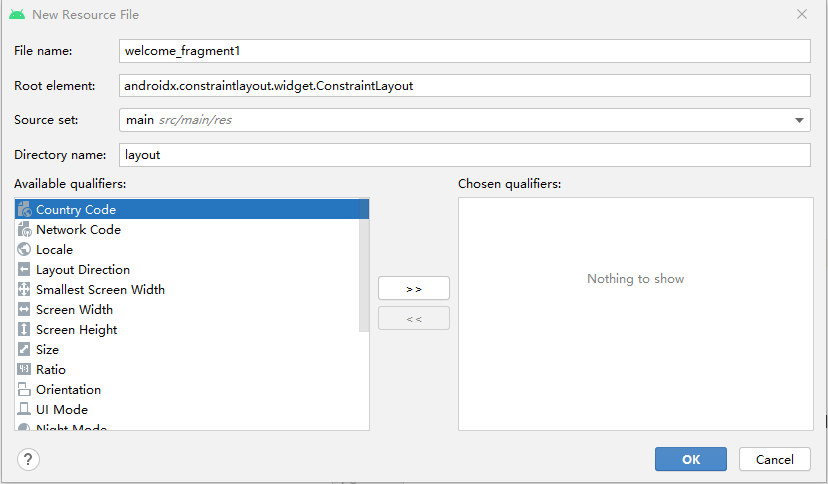
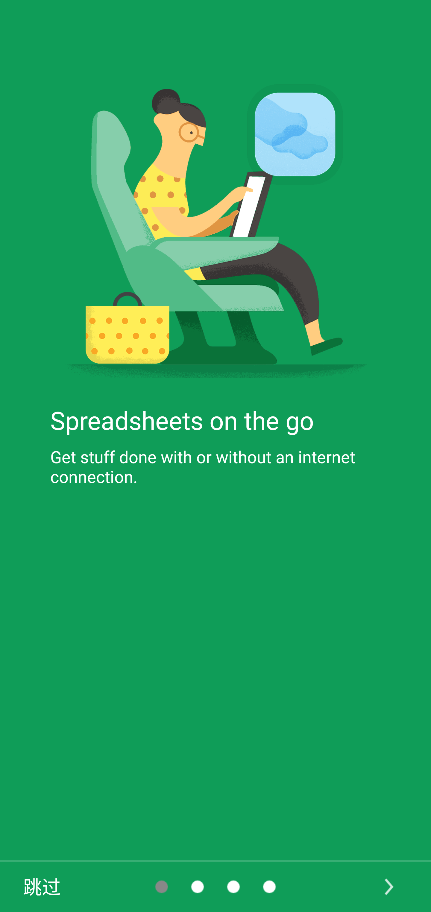

## task3 Fragment与容器控件设计

Fragment从android3.0开始引入，用于设计界面中可重复使用的部分。Fragment有自己的生命周期，可以定义和管理自己的布局，可以相应用户的操作。Fragment类似Activity的功能，但是Fragment不能单独存在，也不能取代Activity而是依附与Activity存在。Fragment可以模块化界面的设计，已到达重用和适应多种设备的效果。

本次任务我们创建一个引导页，在这个引导页里面，展示系统的各项功能。

### 3.1 创建引导页

#### 3.1.1 创建引导页Fragment-ProductTourFragment

依次点击File->New->Fragment->Fragment(Blank)，Fragment Name为：ProductTourFragment，如图所示。


系统会生成类ProductTourFragment.java和布局文件fragment_product_tour.xml。但是我们不准备在这个fragment里面使用布局fragment_product_tour.xml，而是在ProductTourFragment类中创建工厂类根据layoutid动态生成fragment并显示。

为了让整个项目中类的组织更加合理，我们给改fragment的报名后面加上.fragments。

在这个activity里面我们可以通过传入不同的fragment布局文件来生成不同的fragment对象。具体的代码如下：

```java
package pub.renge.filemanage.fragments;

import android.os.Bundle;
import androidx.fragment.app.Fragment;
import android.view.LayoutInflater;
import android.view.View;
import android.view.ViewGroup;

public class ProductTourFragment extends Fragment {

    final static String LAYOUT_ID = "layoutid";

    //工厂方法，用户动态的根据layoutid产生不同的fragment
    public static ProductTourFragment newInstance(int layoutId) {
        ProductTourFragment pane = new ProductTourFragment();
        Bundle args = new Bundle();
        args.putInt(LAYOUT_ID, layoutId);
        pane.setArguments(args);
        return pane;
    }

    //根据传入的不同Bundle对象args类决定用那个layout资源来显示内容
    @Override
    public View onCreateView(LayoutInflater inflater, ViewGroup container, Bundle savedInstanceState) {
        ViewGroup rootView = (ViewGroup) inflater.inflate(getArguments().getInt(LAYOUT_ID, -1), container, false);
        return rootView;
    }

}
```

#### 3.1.2 创建引导页Fragment布局文件

我们一共需要设计五个引导页Fragment布局文件来展示内容，分别是welcome_fragment1-5。首先选中res->layout文件夹，右键或者File->New->Layout Resource File，出现如下对话框。



在filename中依次输入welcome_fragment1-5，创建5个布局文件。

1. 为了更好的展现布局，需要在res->values->dimens.xml中设置所有需要的尺寸和字体大小设置，具体内容如下：

```xml
<resources>
    <!-- Default screen margins, per the Android Design guidelines. -->
    <dimen name="activity_horizontal_margin">16dp</dimen>
    <dimen name="activity_vertical_margin">16dp</dimen>
    <dimen name="nav_header_vertical_spacing">8dp</dimen>
    <dimen name="nav_header_height">176dp</dimen>
    <dimen name="fab_margin">16dp</dimen>

    <dimen name="minimal_material_padding">16dp</dimen>
    <dimen name="check_icon_margin_bottom_right">10dp</dimen>
    <dimen name="minimal_row_size">72dp</dimen>
    <dimen name="minimal_icon_size">40dp</dimen>
    <dimen name="minimal_icon_parent_width">56dp</dimen>
    <dimen name="tick_icon_size">20dp</dimen>
    <dimen name="check_icon_size_grid">40dp</dimen>
    <dimen name="check_icon_padding">4dp</dimen>
    <dimen name="icon_margin_top">16dp</dimen>
    <dimen name="check_view_margin">2dp</dimen>
    <dimen name="splash_bottom_padding">10dp</dimen>
    <dimen name="splash_middle_top_margin">10dp</dimen>
    <dimen name="splash_bottom_margin">40dp</dimen>
    <dimen name="splash_top_margin">130dp</dimen>

    <!--Welcome sliding page  -->
    <dimen name="welcome_images_size">360.0dip</dimen>
    <dimen name="welcome_images_margin_top">0.0dip</dimen>
    <dimen name="welcome_heading_margin_bottom">12.0dip</dimen>
    <dimen name="welcome_text_margin">48.0dip</dimen>
    <dimen name="welcome_heading">24.0sp</dimen>
    <dimen name="welcome_text_margin_bottom">12.0dip</dimen>
    <dimen name="welcome_content_min_height">96.0dip</dimen>
    <dimen name="welcome_content">16.0sp</dimen>
    <dimen name="fab_size">44dp</dimen>
    <dimen name="button_elevation">4dp</dimen>
    <dimen name="button_press_elevation">8dp</dimen>

    <dimen name="big_large_text">24sp</dimen>
    <dimen name="large_text">22sp</dimen>
    <dimen name="big_medium_text">20sp</dimen>
    <dimen name="medium_text">18sp</dimen>
    <dimen name="big_small_text">16sp</dimen>
    <dimen name="small_text">14sp</dimen>
    <dimen name="micro_text">12sp</dimen>

    <dimen name="artist_cover_icon">50dp</dimen>
    <dimen name="album_item_icon_width">155dp</dimen>
    <dimen name="album_item_icon_height">162dp</dimen>
    <dimen name="playing_window">50dp</dimen>
    <dimen name="playing_window_padding">47dp</dimen>
    <dimen name="album_home_item">140dp</dimen>
    <dimen name="album_small_item_icon_width">100dp</dimen>
</resources>
```

dimen就是dimension的缩写，表示尺寸信息。android支持的度量单位有dp,sp,pt,px,mm,in。

dp表示Density independent Pixels，意思是密度无关像素，可以在不同设备上提供一致的界面元素大小，这个单位相对于160dpi（每英寸像素点数）来确立。在160dpi的屏幕上，1dp大约等于1px。当像素密度高时1dp的像素数会适当的增加，当像素密度低时，也可能多个dp对应一个像素。dp和像素的比例会屏幕密度的变化而变化，但不一定是恰好是正比。

sp表示Scale independent Pixels，意思是缩放无关像素，主要用于字体大小的设置，其原理和dp是类似的。

pt表示Points，就是点，表示1/72英寸，基于屏幕的物理尺寸。

px表示Pixels，就是像素，不建议使用，因为不同手机分辨率差异很大，不同手机的显示效果会很大不同。

mm表示Millimeters，就是毫米，基于屏幕的物理尺寸。

in表示inches，就是英寸，基于屏幕的物理尺寸。

其实尺寸信息不一定要保存在dimens.xml中，可以自己创建一个xml文件，只要里面是<resource></resource>节里面是<dimen>元素即可。


2. 确保系统所需的图片资源都复制到项目的资源目录之下，资源文件的地址是[material.rar](/files/material.rar)，把里面所有的mipmap-xxx目录拷贝到系统资源目录res下。

android在设置图片资源时，为了适应不同像素密度的设备，所以在资源中可以提供每个位图的多个版本。如果只提供一个版本，android将会缩放该位图，可能导致失真模糊等现象。

ldpi：low density，用于低密度屏幕，大约120dpi，图片大小建议36×36

mdpi：medium density，用于中密度屏幕，大约160dpi

hdpi：high density，用于高密度屏幕，大约240dpi

xhdpi：extra-high-density，用于超高密度屏幕，大约320dpi

xxhdpi：extra-extra-hight-density，用于超超高密度屏幕，大约480dpi

xxxdpi：extra-extra-extra-high-density，用于超超超高密度屏幕，大约640dpi

如果你要为以上不同显示密度创建不同的位图，那么应该遵循3:4:6:8:12:16这样的缩放比例，假如你为中密度屏幕设计了一个48×48的屏幕，所以其它的尺寸应该这样设计。

ldpi：36×36

mdpi：48×48

hdpi：72×72

xhdpi：96×96

xxhdpi：144×144

xxxhdpi：192×192


3. 在themes.xml文件中添加几条样式信息为欢迎页的内容定义了样式。通过样式来管理一类格式信息，可以做到修改一个样式，所有参照样式的地方的格式也会随着改变。

```xml
<style name="WelcomeHeadingAppearance" parent="@android:style/TextAppearance.Large">
    <item name="android:textSize">@dimen/welcome_heading</item>
    <item name="android:textColor">@android:color/white</item>
</style>

<style name="WelcomeContentAppearance" parent="@android:style/TextAppearance">
    <item name="android:textSize">@dimen/welcome_content</item>
    <item name="android:textColor">@android:color/white</item>
</style>
```


4. welcome_fragment1.xml 用于展示欢迎页，具体布局文件如下

```xml
<?xml version="1.0" encoding="utf-8"?>
<androidx.constraintlayout.widget.ConstraintLayout xmlns:android="http://schemas.android.com/apk/res/android"
    android:id="@+id/welcome_fragment"
    android:layout_width="match_parent"
    android:layout_height="match_parent"
    xmlns:app="http://schemas.android.com/apk/res-auto">
    <FrameLayout
        android:id="@+id/images"
        android:layout_width="@dimen/welcome_images_size"
        android:layout_height="@dimen/welcome_images_size"
        app:layout_constraintTop_toTopOf="parent"
        app:layout_constraintLeft_toLeftOf="parent"
        app:layout_constraintRight_toRightOf="parent"
        android:layout_centerHorizontal="true"
        android:layout_marginTop="@dimen/welcome_images_margin_top"
        android:clipChildren="false">
        <ImageView
            android:id="@+id/a000"
            android:layout_width="wrap_content"
            android:layout_height="wrap_content"
            android:scaleType="centerInside"
            android:src="@mipmap/image1_b_01"
            android:layout_marginTop="48dp"
            android:layout_marginLeft="32dp"
            android:layout_marginRight="32dp"
            android:layout_gravity="center"/>
        <ImageView
            android:id="@+id/a001"
            android:layout_width="80dp"
            android:layout_height="80dp"
            android:layout_marginBottom="8dp"
            android:scaleType="centerInside"
            android:src="@mipmap/image1_a_01"
            android:layout_gravity="left|bottom"
            android:layout_marginLeft="56dp" />
        <ImageView
            android:id="@+id/a002"
            android:layout_width="96dp"
            android:layout_height="96dp"
            android:layout_marginTop="80dp"
            android:layout_marginRight="56dp"
            android:scaleType="centerInside"
            android:src="@mipmap/image1_c_01"
            android:layout_gravity="right|top"/>
    </FrameLayout>

    <TextView
        android:id="@+id/heading"
        android:layout_width="fill_parent"
        android:layout_height="wrap_content"
        app:layout_constraintTop_toBottomOf="@id/images"
        app:layout_constraintLeft_toLeftOf="@id/images"
        android:layout_marginTop="24dp"
        android:layout_marginLeft="@dimen/welcome_text_margin"
        android:layout_marginRight="@dimen/welcome_text_margin"
        android:text="@string/welcom_head_01"
        android:textAppearance="@style/WelcomeHeadingAppearance" />

    <TextView
        android:id="@+id/content"
        android:text="@string/welcom_content_01"
        android:layout_width="fill_parent"
        android:layout_height="wrap_content"
        app:layout_constraintLeft_toLeftOf="@id/images"
        app:layout_constraintTop_toBottomOf="@id/heading"
        android:layout_marginTop="8dp"
        android:layout_marginLeft="@dimen/welcome_text_margin"
        android:layout_marginRight="@dimen/welcome_text_margin"
        android:minHeight="@dimen/welcome_content_min_height"
        android:textAppearance="@style/WelcomeContentAppearance" />
</androidx.constraintlayout.widget.ConstraintLayout>
```


5. welcome_fragment2.xml的具体内容如下.

```xml
<?xml version="1.0" encoding="utf-8"?>
<androidx.constraintlayout.widget.ConstraintLayout xmlns:android="http://schemas.android.com/apk/res/android"
    android:id="@+id/welcome_fragment"
    android:layout_width="match_parent"
    android:layout_height="match_parent"
    android:background="#f4b400"
    xmlns:app="http://schemas.android.com/apk/res-auto">


    <FrameLayout
        android:id="@id/images"
        android:layout_width="@dimen/welcome_images_size"
        android:layout_height="@dimen/welcome_images_size"
        app:layout_constraintTop_toTopOf="parent"
        app:layout_constraintLeft_toLeftOf="parent"
        app:layout_constraintRight_toRightOf="parent"
        android:layout_marginTop="@dimen/welcome_images_margin_top"
        android:clipChildren="false">
        <ImageView
            android:layout_width="wrap_content"
            android:layout_height="wrap_content"
            android:scaleType="centerInside"
            android:src="@mipmap/image2_c_01"
            android:layout_gravity="center"/>
        <ImageView
            android:layout_width="320dp"
            android:layout_height="320dp"
            android:scaleType="centerInside"
            android:src="@mipmap/image2_a_01"
            android:layout_gravity="right|center_vertical"/>
        <ImageView
            android:id="@+id/a003"
            android:layout_width="80dp"
            android:layout_height="80dp"
            android:scaleType="centerInside"
            android:src="@mipmap/image2_b_01"
            android:layout_marginLeft="56dp"
            android:layout_marginBottom="24dp"
            android:layout_gravity="left|bottom"/>

        <ImageView
            android:id="@+id/a004"
            android:layout_width="80dp"
            android:layout_height="80dp"
            android:layout_marginTop="64dp"
            android:layout_marginRight="64dp"
            android:scaleType="centerInside"
            android:src="@mipmap/image2_b_02"
            android:layout_gravity="right|top"/>
        <ImageView
            android:id="@+id/a005"
            android:layout_width="80dp"
            android:layout_height="80dp"
            android:scaleType="centerInside"
            android:layout_marginBottom="114dp"
            android:layout_marginRight="40dp"
            android:src="@mipmap/image2_b_03"
            android:layout_gravity="right|bottom"/>
        <ImageView
            android:id="@+id/a006"
            android:layout_width="80dp"
            android:layout_height="80dp"
            android:scaleType="centerInside"
            android:layout_marginTop="112dp"
            android:layout_marginLeft="8dp"
            android:src="@mipmap/image2_b_04"
            android:layout_gravity="left|top"/>
    </FrameLayout>

    <TextView
        android:id="@id/heading"
        android:text="@string/welcom_head_02"
        android:layout_width="fill_parent"
        android:layout_height="wrap_content"
        app:layout_constraintTop_toBottomOf="@id/images"
        app:layout_constraintLeft_toLeftOf="@id/images"
        android:layout_marginTop="24dp"
        android:layout_marginLeft="@dimen/welcome_text_margin"
        android:layout_marginRight="@dimen/welcome_text_margin"
        android:textAppearance="@style/WelcomeHeadingAppearance" />

    <TextView
        android:id="@id/content"
        android:text="@string/welcom_content_02"
        android:layout_width="fill_parent"
        android:layout_height="wrap_content"
        app:layout_constraintLeft_toLeftOf="@id/images"
        app:layout_constraintTop_toBottomOf="@id/heading"
        android:layout_marginTop="8dp"
        android:layout_marginLeft="@dimen/welcome_text_margin"
        android:layout_marginRight="@dimen/welcome_text_margin"
        android:minHeight="@dimen/welcome_content_min_height"
        android:textAppearance="@style/WelcomeContentAppearance" />

</androidx.constraintlayout.widget.ConstraintLayout>
```


6. welcome_fragment3.xml的设计如下：

```xml
<?xml version="1.0" encoding="utf-8"?>
<androidx.constraintlayout.widget.ConstraintLayout xmlns:android="http://schemas.android.com/apk/res/android"
    android:id="@+id/welcome_fragment"
    android:layout_width="match_parent"
    xmlns:app="http://schemas.android.com/apk/res-auto"
    android:background="#00bcd4"
    android:layout_height="match_parent">
    <FrameLayout
        android:id="@+id/images"
        android:layout_width="@dimen/welcome_images_size"
        android:layout_height="@dimen/welcome_images_size"
        app:layout_constraintTop_toTopOf="parent"
        app:layout_constraintLeft_toLeftOf="parent"
        android:layout_centerHorizontal="true"
        android:layout_marginTop="@dimen/welcome_images_margin_top"
        android:clipChildren="false">
        <ImageView
            android:id="@+id/a011"
            android:layout_width="wrap_content"
            android:layout_height="wrap_content"
            android:scaleType="centerInside"
            android:src="@mipmap/image3_a_01"
            android:layout_gravity="left|bottom"
            android:layout_marginBottom="38dp"/>
        <ImageView
            android:id="@+id/a007"
            android:layout_width="wrap_content"
            android:layout_height="wrap_content"
            android:scaleType="centerInside"
            android:src="@mipmap/image3_b_01"
            android:layout_gravity="bottom|right"
            android:layout_marginBottom="16dp"/>
        <ImageView
            android:id="@+id/a008"
            android:layout_width="wrap_content"
            android:layout_height="wrap_content"
            android:scaleType="centerInside"
            android:layout_marginTop="24dp"
            android:src="@mipmap/image3_c_01"
            android:layout_gravity="right|top"/>
    </FrameLayout>

    <TextView
        android:id="@+id/heading"
        android:text="@string/welcom_head_03"
        android:layout_width="fill_parent"
        android:layout_height="wrap_content"
        app:layout_constraintTop_toBottomOf="@id/images"
        app:layout_constraintLeft_toLeftOf="@id/images"
        android:layout_marginTop="24dp"
        android:layout_marginLeft="@dimen/welcome_text_margin"
        android:layout_marginRight="@dimen/welcome_text_margin"
        android:textAppearance="@style/WelcomeHeadingAppearance" />

    <TextView
        android:id="@+id/content"
        android:text="@string/welcom_content_03"
        android:layout_width="fill_parent"
        android:layout_height="wrap_content"
        app:layout_constraintLeft_toLeftOf="@id/images"
        app:layout_constraintTop_toBottomOf="@id/heading"
        android:layout_marginTop="8dp"
        android:layout_marginLeft="@dimen/welcome_text_margin"
        android:layout_marginRight="@dimen/welcome_text_margin"
        android:minHeight="@dimen/welcome_content_min_height"
        android:textAppearance="@style/WelcomeContentAppearance" />
</androidx.constraintlayout.widget.ConstraintLayout>
```


7. welcome_fragment4.xml的设计如下：

```xml
<?xml version="1.0" encoding="utf-8"?>
<androidx.constraintlayout.widget.ConstraintLayout xmlns:android="http://schemas.android.com/apk/res/android"
    android:id="@+id/welcome_fragment"
    android:layout_width="match_parent"
    xmlns:app="http://schemas.android.com/apk/res-auto"
    android:background="#3367d6"
    android:layout_height="match_parent">
    <FrameLayout
        android:id="@+id/images"
        android:layout_width="@dimen/welcome_images_size"
        android:layout_height="@dimen/welcome_images_size"
        app:layout_constraintTop_toTopOf="parent"
        app:layout_constraintLeft_toLeftOf="parent"
        android:layout_alignParentTop="true"
        android:layout_centerHorizontal="true"
        android:layout_marginTop="@dimen/welcome_images_margin_top"
        android:clipChildren="false">
        <ImageView
            android:id="@+id/a013"
            android:layout_width="wrap_content"
            android:layout_height="wrap_content"
            android:scaleType="centerInside"
            android:src="@mipmap/image4_a_01"
            android:layout_gravity="left|bottom"/>
        <ImageView
            android:id="@+id/a010"
            android:layout_width="wrap_content"
            android:layout_height="wrap_content"
            android:scaleType="centerInside"
            android:layout_marginBottom="24dp"
            android:src="@mipmap/image4_b_01"
            android:layout_gravity="right|bottom"/>
        <ImageView
            android:id="@+id/a012"
            android:layout_width="wrap_content"
            android:layout_height="wrap_content"
            android:scaleType="centerInside"
            android:layout_marginTop="16dp"
            android:src="@mipmap/image4_c_01"
            android:layout_gravity="left|top"/>
    </FrameLayout>

    <TextView
        android:id="@+id/heading"
        android:text="@string/welcom_head_04"
        android:layout_width="fill_parent"
        android:layout_height="wrap_content"
        app:layout_constraintTop_toBottomOf="@id/images"
        app:layout_constraintLeft_toLeftOf="@id/images"
        android:layout_marginTop="24dp"
        android:layout_marginLeft="@dimen/welcome_text_margin"
        android:layout_marginRight="@dimen/welcome_text_margin"
        android:textAppearance="@style/WelcomeHeadingAppearance" />

    <TextView
        android:id="@+id/content"
        android:text="@string/welcom_content_04"
        android:layout_width="fill_parent"
        android:layout_height="wrap_content"
        app:layout_constraintLeft_toLeftOf="@id/images"
        app:layout_constraintTop_toBottomOf="@id/heading"
        android:layout_marginTop="8dp"
        android:layout_marginLeft="@dimen/welcome_text_margin"
        android:layout_marginRight="@dimen/welcome_text_margin"
        android:minHeight="@dimen/welcome_content_min_height"
        android:textAppearance="@style/WelcomeContentAppearance" />
</androidx.constraintlayout.widget.ConstraintLayout>
```


8. welcome_fragment5.xml是最后一个fragment设计成透明的，具体设计如下：

```xml
<?xml version="1.0" encoding="utf-8"?>
<androidx.constraintlayout.widget.ConstraintLayout
    xmlns:android="http://schemas.android.com/apk/res/android" android:layout_width="match_parent"
    android:layout_height="match_parent"
    android:background="@android:color/transparent">

</androidx.constraintlayout.widget.ConstraintLayout>
```


9. colors.xml文件是设置系统中出现的颜色

```xml
<?xml version="1.0" encoding="utf-8"?>
<resources>
    <color name="purple_200">#FFBB86FC</color>
    <color name="purple_500">#FF6200EE</color>
    <color name="purple_700">#FF3700B3</color>
    <color name="teal_200">#FF03DAC5</color>
    <color name="teal_700">#FF018786</color>
    <color name="black">#FF000000</color>
    <color name="white">#FFFFFFFF</color>

    <color name="colorPrimary">#3F51B5</color>
    <color name="colorPrimaryDark">#303F9F</color>
    <color name="colorAccent">#FF4081</color>

    <color name="theme_primary">#673ab7</color>
    <color name="holo">#8833B5E5</color>
    <color name="safr">#5f777777</color>
    <color name="safrs">#5f777777</color>
    <color name="bar">#3f333333</color>
    <color name="safr_ripple">#ffc3c3c3</color>
    <color name="safr_pressed">#ffd7d7d7</color>
    <color name="safr_pressed_dark">#ff282828</color>
    <color name="holo_dark_background_new">#ff263238</color>
    <color name="holo_dark_background">#303030</color>
    <color name="holo_dark_text">#ff777777</color>
    <color name="holo_dark_action_mode">#212121</color>
    <color name="holo_dark_selection">#424242</color>
    <color name="divider">#e0e0e0</color>
    <color name="divider_dark">#474747</color>
    <color name="search_text_highlight">#FF9632</color>
    <!-- TODO: replace this hardcoded color with default list item selection color -->
    <color name="check_background">#EEEEEE</color>
    <color name="grid_background_light">#f2f2f2</color>

    <!-- primary color palatte -->
    <color name="primary_red">#F44336</color>
    <color name="primary_pink">#e91e63</color>
    <color name="primary_purple">#9c27b0</color>
    <color name="primary_deep_purple">#673ab7</color>
    <color name="primary_indigo">#3f51b5</color>
    <color name="primary_blue">#2196F3</color>
    <color name="primary_light_blue">#03A9F4</color>
    <color name="primary_cyan">#00BCD4</color>
    <color name="primary_teal">#009688</color>
    <color name="primary_green">#4CAF50</color>
    <color name="primary_light_green">#8bc34a</color>
    <color name="primary_amber">#FFC107</color>
    <color name="primary_orange">#FF9800</color>
    <color name="primary_deep_orange">#FF5722</color>
    <color name="primary_brown">#795548</color>
    <color name="primary_black">#000000</color>
    <color name="primary_blue_grey">#607d8b</color>
    <color name="primary_super_su">#004d40</color>

    <!-- accent color palatte -->
    <color name="accent_red">#F44336</color>
    <color name="accent_pink">#e91e63</color>
    <color name="accent_purple">#9c27b0</color>
    <color name="accent_deep_purple">#673ab7</color>
    <color name="accent_indigo">#3f51b5</color>
    <color name="accent_blue">#2196F3</color>
    <color name="accent_light_blue">#03A9F4</color>
    <color name="accent_cyan">#00BCD4</color>
    <color name="accent_teal">#009688</color>
    <color name="accent_green">#4CAF50</color>
    <color name="accent_light_green">#8bc34a</color>
    <color name="accent_amber">#FFC107</color>
    <color name="accent_orange">#FF9800</color>
    <color name="accent_deep_orange">#FF5722</color>
    <color name="accent_brown">#795548</color>
    <color name="accent_black">#212121</color>
    <color name="accent_blue_grey">#607d8b</color>
    <color name="accent_super_su">#004d40</color>

    <!-- indicator -->
    <color name="page_indicator_dark">#80333333</color>
    <color name="page_indicator_dark_selected">#ff333333</color>

    <!-- cardview foreground and background -->
    <color name="cardView_foreground">#202020</color>
    <color name="cardView_background">#363F45</color>

    <color name="accent">#FF4081</color>

    <color name="text_selected">#888</color>

    <color name="alpha_05_white">#0DFFFFFF</color>
    <color name="alpha_10_white">#1AFFFFFF</color>
    <color name="alpha_15_white">#26FFFFFF</color>
    <color name="alpha_20_white">#33FFFFFF</color>
    <color name="alpha_25_white">#40FFFFFF</color>
    <color name="alpha_30_white">#4DFFFFFF</color>
    <color name="alpha_35_white">#59FFFFFF</color>
    <color name="alpha_40_white">#66FFFFFF</color>
    <color name="alpha_45_white">#73FFFFFF</color>
    <color name="alpha_50_white">#80FFFFFF</color>
    <color name="alpha_55_white">#8CFFFFFF</color>
    <color name="alpha_60_white">#99FFFFFF</color>
    <color name="alpha_65_white">#A6FFFFFF</color>
    <color name="alpha_70_white">#B3FFFFFF</color>
    <color name="alpha_75_white">#BFFFFFFF</color>
    <color name="alpha_80_white">#CCFFFFFF</color>
    <color name="alpha_85_white">#D9FFFFFF</color>
    <color name="alpha_90_white">#E6FFFFFF</color>
    <color name="alpha_95_white">#F2FFFFFF</color>
</resources>
```


#### 3.1.3 在build.gradle里面的dependencies里面添加必要的依赖包

在本节我们会用到一些第三方组件，比如nineoldandroids来实现动画效果。

```
implementation 'com.nineoldandroids:library:2.4.0'
```

加好依赖后可以重新Sync项目。


#### 3.1.4 创建引导页Activity-ProductTourActivity

上面已经创建了一个fragment用于展示不同的引导页，现在我们要创建Activity来展示这些fragment。依次点击File->New->Activity->Empty Activity，出现Activity配置界面，Activity名称为ProductTourActivity，自动产生布局文件，设为启动Activity，设置包名为pub.renge.filemanage，最后点击Finish完成。

在这个activity里面我们要通过viewpager组件来展示多个fragment。

1. 准备需要的drawable文件。从[material.rar](files/material.rar) 中提取drawable文件夹下所有文件到项目的drawable文件夹下。然后在drawable文件夹下面新建两个drawable文件bg_item_selected_drawable.xml和selectable_item_background_general，其中bg_item_selected_drawable.xml中定义了形状信息是实线的颜色。

```xml
<?xml version="1.0" encoding="utf-8"?>
<shape xmlns:android="http://schemas.android.com/apk/res/android">
    <solid android:color="#12000000" />
</shape>
```

selectable_item_background_general.xml的内容如下：

```xml
<?xml version="1.0" encoding="utf-8"?>
<selector xmlns:android="http://schemas.android.com/apk/res/android" android:exitFadeDuration="@android:integer/config_mediumAnimTime">
    <item android:drawable="@drawable/bg_item_selected_drawable" android:state_focused="true" android:state_pressed="false" />
    <item android:drawable="@drawable/bg_item_selected_drawable" android:state_pressed="true" />
    <item android:drawable="@android:color/transparent" />
</selector>
```


2. 布局文件activity_product_tour.xml中设置一个viewpager来展示多个fragment。具体设计如下:

```xml
<?xml version="1.0" encoding="utf-8"?>
<androidx.constraintlayout.widget.ConstraintLayout xmlns:android="http://schemas.android.com/apk/res/android"
    xmlns:app="http://schemas.android.com/apk/res-auto"
    xmlns:tools="http://schemas.android.com/tools"
    android:layout_width="match_parent"
    android:layout_height="match_parent"
    tools:context=".ProductTourActivity"
    android:background="@android:color/transparent">
    <androidx.viewpager.widget.ViewPager
        android:id="@+id/pager"
        android:layout_width="match_parent"
        android:layout_height="match_parent"
        android:background="@color/dim_foreground_disabled_material_dark" />

    <View
        android:layout_width="fill_parent"
        android:layout_height="1dp"
        app:layout_constraintLeft_toLeftOf="parent"
        app:layout_constraintRight_toRightOf="parent"
        app:layout_constraintBottom_toTopOf="@id/button_layout"
        android:background="#33ffffff" />

    <RelativeLayout
        android:id="@+id/button_layout"
        android:layout_width="fill_parent"
        android:layout_height="wrap_content"
        app:layout_constraintLeft_toLeftOf="parent"
        app:layout_constraintRight_toRightOf="parent"
        app:layout_constraintBottom_toBottomOf="parent"
        android:background="@android:color/transparent">

        <Button
            android:id="@+id/skip"
            android:layout_width="80dp"
            android:layout_height="48dp"
            android:layout_alignParentLeft="true"
            android:background="@drawable/selectable_item_background_general"
            android:gravity="center"
            android:text="@string/skip"
            android:textColor="@color/abc_primary_text_material_dark"
            android:textSize="18sp" />

        <LinearLayout
            android:id="@+id/circles"
            android:layout_width="wrap_content"
            android:layout_height="wrap_content"
            android:layout_centerInParent="true"
            android:orientation="horizontal">
        </LinearLayout>

        <Button
            android:id="@+id/done"
            android:layout_width="80dp"
            android:layout_height="48dp"
            android:layout_alignParentRight="true"
            android:background="@drawable/selectable_item_background_general"
            android:gravity="center"
            android:text="@string/done"
            android:textColor="@color/abc_search_url_text_normal"
            android:textSize="18sp"
            android:visibility="gone" />

        <ImageButton
            android:id="@+id/next"
            android:layout_width="80dp"
            android:layout_height="48dp"
            android:layout_alignParentRight="true"
            android:background="@drawable/selectable_item_background_general"
            android:gravity="center"
            android:paddingBottom="12dp"
            android:paddingTop="12dp"
            android:scaleType="fitCenter"
            android:src="@mipmap/ic_action_next" />    
    </RelativeLayout>
</androidx.constraintlayout.widget.ConstraintLayout>
```

在这个布局中，ViewPager用于展示Fragment，View用于展示下方的分割横线，最后是个RelativeLayout布局，里面有个按钮skip表示“跳过”，有个按钮done表示“结束”，有个next的图片按钮显示右箭头，还有个LineaLayout用于显示多个小圆圈表示当前是第几个Fragment。


3. 布局设计好了之后就是编写程序ProductTourActivity的代码了，具体如下：

```java
public class ProductTourActivity extends AppCompatActivity {
    //一共5个Fragment
    static final int NUM_PAGES = 5;
    //pager用于展示Fragment
    ViewPager pager;
    //pagerAdapter用于pager中数据页面切换
    PagerAdapter pagerAdapter;
    //circles使用多个圆圈展示当前是第几个Fragment
    LinearLayout circles;
    //跳过按钮，点击跳过向导页
    Button skip;
    //结束按钮，点击结束向导页
    Button done;
    //下一个按钮，点击切换到下一个Fragment
    ImageButton next;

    boolean isOpaque = true;

    @Override
    protected void onCreate(Bundle savedInstanceState) {
        super.onCreate(savedInstanceState);
        Window window = getWindow();
        window.setFlags(WindowManager.LayoutParams.FLAG_TRANSLUCENT_STATUS, WindowManager.LayoutParams.FLAG_TRANSLUCENT_STATUS);

        setContentView(R.layout.activity_product_tour);

        //跳过按钮设置
        skip = Button.class.cast(findViewById(R.id.skip));
        skip.setOnClickListener(new View.OnClickListener() {
            @Override
            public void onClick(View v) {
                endTutorial();
            }
        });

        //下一个按钮设置
        next = ImageButton.class.cast(findViewById(R.id.next));
        next.setOnClickListener(new View.OnClickListener() {
            @Override
            public void onClick(View v) {
                pager.setCurrentItem(pager.getCurrentItem() + 1, true);
            }
        });

        //结束按钮设置
        done = Button.class.cast(findViewById(R.id.done));
        done.setOnClickListener(new View.OnClickListener() {
            @Override
            public void onClick(View v) {
                endTutorial();
            }
        });
        
        //pager初始化，用于展示多个Fragment
        pager = (ViewPager) findViewById(R.id.pager);
        pagerAdapter = new ScreenSlidePagerAdapter(getSupportFragmentManager());
        pager.setAdapter(pagerAdapter);
        pager.setPageTransformer(true, new CrossfadePageTransformer());
        pager.addOnPageChangeListener(new TourPageChangeListener());
        //圆圈初始化，默认选中第0个位置
        buildCircles();
    }


    @Override
    protected void onDestroy() {
        super.onDestroy();
        if (pager != null) {
            pager.clearOnPageChangeListeners();
        }
    }

    /**
     * 根据页面数生成圆圈信息，并设置第0个为选中状态
     */
    private void buildCircles() {
        circles = LinearLayout.class.cast(findViewById(R.id.circles));
        float scale = getResources().getDisplayMetrics().density;
        int padding = (int) (5 * scale + 0.5f);
        for (int i = 0; i < NUM_PAGES - 1; i++) {
            ImageView circle = new ImageView(this);
            circle.setImageResource(R.mipmap.ic_swipe_indicator_white_18dp);
            circle.setLayoutParams(new ViewGroup.LayoutParams(ViewGroup.LayoutParams.WRAP_CONTENT, ViewGroup.LayoutParams.WRAP_CONTENT));
            circle.setAdjustViewBounds(true);
            circle.setPadding(padding, 0, padding, 0);
            circles.addView(circle);
        }
        setIndicator(0);
    }

    /**
     * 设置圆圈的选中状态
     * @param index
     */
    private void setIndicator(int index) {
        if (index < NUM_PAGES) {
            for (int i = 0; i < NUM_PAGES - 1; i++) {
                ImageView circle = (ImageView) circles.getChildAt(i);
                if (i == index) {
                    circle.setColorFilter(getResources().getColor(R.color.text_selected));
                } else {
                    circle.setColorFilter(getResources().getColor(android.R.color.transparent));
                }
            }
        }
    }

    /**
     * 向导结束
     */
    private void endTutorial() {
        finish();
        overridePendingTransition(R.anim.abc_fade_in, R.anim.abc_fade_out);
    }

    /**
     * 滑动页面适配器，用于选择当前fragment
     */
    private class ScreenSlidePagerAdapter extends FragmentStatePagerAdapter {

        final int[] fragments = new int[]{R.layout.welcome_fragment1, R.layout.welcome_fragment2, R.layout.welcome_fragment3, R.layout.welcome_fragment4, R.layout.welcome_fragment5};

        public ScreenSlidePagerAdapter(FragmentManager fm) {
            super(fm, BEHAVIOR_RESUME_ONLY_CURRENT_FRAGMENT);
        }

        @Override
        public Fragment getItem(int position) {
            ProductTourFragment tp = null;
            tp = ProductTourFragment.newInstance(fragments[position]);
            return tp;
        }

        @Override
        public int getCount() {
            return NUM_PAGES;
        }
    }

    /**
     * 展示切换的动画
     */
    public class CrossfadePageTransformer implements ViewPager.PageTransformer {

        @Override
        public void transformPage(View page, float position) {
            int pageWidth = page.getWidth();

            View backgroundView = page.findViewById(R.id.welcome_fragment);
            View text_head = page.findViewById(R.id.heading);
            View text_content = page.findViewById(R.id.content);
            View object1 = page.findViewById(R.id.a000);
            View object2 = page.findViewById(R.id.a001);

            View object3 = page.findViewById(R.id.a002);
            View object4 = page.findViewById(R.id.a003);
            View object5 = page.findViewById(R.id.a004);
            View object6 = page.findViewById(R.id.a005);
            View object7 = page.findViewById(R.id.a006);
            View object8 = page.findViewById(R.id.a008);
            View object9 = page.findViewById(R.id.a010);
            View object10 = page.findViewById(R.id.a011);
            View object11 = page.findViewById(R.id.a007);
            View object12 = page.findViewById(R.id.a012);
            View object13 = page.findViewById(R.id.a013);

            if (0 < position && position < 1) {
                ViewHelper.setTranslationX(page, pageWidth * -position);
            }
            if (-1 < position && position < 0) {
                ViewHelper.setTranslationX(page, pageWidth * -position);
            }

            if (position <= -1.0f || position >= 1.0f) {
            } else if (position == 0.0f) {
            } else {
                if (backgroundView != null) {
                    ViewHelper.setAlpha(backgroundView, 1.0f - Math.abs(position));

                }

                if (text_head != null) {
                    ViewHelper.setTranslationX(text_head, pageWidth * position);
                    ViewHelper.setAlpha(text_head, 1.0f - Math.abs(position));
                }

                if (text_content != null) {
                    ViewHelper.setTranslationX(text_content, pageWidth * position);
                    ViewHelper.setAlpha(text_content, 1.0f - Math.abs(position));
                }

                if (object1 != null) {
                    ViewHelper.setTranslationX(object1, pageWidth * position);
                }

                // parallax effect
                if (object2 != null) {
                    ViewHelper.setTranslationX(object2, pageWidth * position);
                }

                if (object4 != null) {
                    ViewHelper.setTranslationX(object4, pageWidth / 2 * position);
                }
                if (object5 != null) {
                    ViewHelper.setTranslationX(object5, pageWidth / 2 * position);
                }
                if (object6 != null) {
                    ViewHelper.setTranslationX(object6, pageWidth / 2 * position);
                }
                if (object7 != null) {
                    ViewHelper.setTranslationX(object7, pageWidth / 2 * position);
                }

                if (object8 != null) {
                    ViewHelper.setTranslationX(object8, (float) (pageWidth / 1.5 * position));
                }

                if (object9 != null) {
                    ViewHelper.setTranslationX(object9, (float) (pageWidth / 2 * position));
                }

                if (object10 != null) {
                    ViewHelper.setTranslationX(object10, pageWidth / 2 * position);
                }

                if (object11 != null) {
                    ViewHelper.setTranslationX(object11, (float) (pageWidth / 1.2 * position));
                }

                if (object12 != null) {
                    ViewHelper.setTranslationX(object12, (float) (pageWidth / 1.3 * position));
                }

                if (object13 != null) {
                    ViewHelper.setTranslationX(object13, (float) (pageWidth / 1.8 * position));
                }

                if (object3 != null) {
                    ViewHelper.setTranslationX(object3, (float) (pageWidth / 1.2 * position));
                }
            }
        }
    }

    /**
     * 切换屏幕时调用
     */
    private class TourPageChangeListener implements ViewPager.OnPageChangeListener{
        @Override
        public void onPageScrolled(int position, float positionOffset, int positionOffsetPixels) {

            if (position == NUM_PAGES - 2 && positionOffset > 0) {
                if (isOpaque) {
                    pager.setBackgroundColor(Color.TRANSPARENT);
                    isOpaque = false;
                }
            } else {
                if (!isOpaque) {
                    pager.setBackgroundColor(getResources().getColor(R.color.primary_material_light));
                    isOpaque = true;
                }
            }
        }

        @Override
        public void onPageSelected(int position) {
            setIndicator(position);
            if (position == NUM_PAGES - 2) {
                skip.setVisibility(View.GONE);
                next.setVisibility(View.GONE);
                done.setVisibility(View.VISIBLE);
            } else if (position < NUM_PAGES - 2) {
                skip.setVisibility(View.VISIBLE);
                next.setVisibility(View.VISIBLE);
                done.setVisibility(View.GONE);
            } else if (position == NUM_PAGES - 1) {
                endTutorial();
            }
        }

        @Override
        public void onPageScrollStateChanged(int state) {

        }
    }
}
```

4. 新建PrefConstants类，修改其代码如下：

```java
package pub.renge.filemanage.preferences;

import android.content.Context;
import android.content.SharedPreferences;
import android.content.SharedPreferences.Editor;
import android.os.Build;
import android.preference.PreferenceManager;

public class PrefConstants {

    public static int getAppPrefInt(Context context, String prefName) {
        int result = -1;
        if (context != null) {
            SharedPreferences sharedPreferences = PreferenceManager.getDefaultSharedPreferences(context);
            if (sharedPreferences != null) {
                result = sharedPreferences.getInt(
                        prefName, -1);
            }
        }
        return result;
    }

    public static void putAppPrefInt(Context context, String prefName, int value) {
        if (context != null) {
            SharedPreferences sharedPreferences = PreferenceManager.getDefaultSharedPreferences(context);
            Editor edit = sharedPreferences.edit();
            edit.putInt(prefName, value);
            if (Build.VERSION.SDK_INT >= 9) {
                edit.apply();
            } else {
                edit.commit();
            }
        }
    }

    public final static String[] colors = new String[]{
            "#F44336",
            "#e91e63",
            "#9c27b0",
            "#673ab7",
            "#3f51b5",
            "#2196F3",
            "#03A9F4",
            "#00BCD4",
            "#009688",
            "#4CAF50",
            "#8bc34a",
            "#FFC107",
            "#FF9800",
            "#FF5722",
            "#795548",
            "#212121",
            "#607d8b",
            "#004d40"
    };
    public static final String LICENCE_TERMS = "<html><body>" +
            "<h3>Notices for files:</h3>" +
            "<ul><li>nineoldandroids-2.4.0.jar</ul></li>" +    //nineoldandroids
            "<p style = 'background-color:#eeeeee;padding-left:1em'><code>" +
            "<br>/*<br>" +
            "&nbsp;* Copyright 2012 Jake Wharton<br>" +
            "&nbsp;* <br>" +
            "&nbsp;* Licensed under the Apache License, Version 2.0 (the \"License\");<br>" +
            "&nbsp;* you may not use this file except in compliance with the License.<br>" +
            "&nbsp;* You may obtain a copy of the License at<br>" +
            "&nbsp;* <br>" +
            "&nbsp;* &nbsp;&nbsp;&nbsp;http://www.apache.org/licenses/LICENSE-2.0<br>" +
            "&nbsp;* <br>" +
            "&nbsp;* Unless required by applicable law or agreed to in writing, software<br>" +
            "&nbsp;* distributed under the License is distributed on an \"AS IS\" BASIS,<br>" +
            "&nbsp;* WITHOUT WARRANTIES OR CONDITIONS OF ANY KIND, either express or implied.<br>" +
            "&nbsp;* See the License for the specific language governing permissions and<br>" +
            "&nbsp;* limitations under the License.<br>" +
            "&nbsp;*/ " +
            "<br><br></code></p>" +
            "<h3>Notices for files:</h3> " +
            "<ul><li>RootTools.jar</ul></li>" +    //RootTools
            "<p style = 'background-color:#eeeeee;padding-left:1em'><code>" +
            "<br>/*<br>" +
            "&nbsp;* This file is part of the RootTools Project: http://code.google.com/p/roottools/<br>" +
            "&nbsp;*<br>" +
            "&nbsp;* Copyright (c) 2012 Stephen Erickson, Chris Ravenscroft, Dominik Schuermann, Adam Shanks<br>" +
            "&nbsp;*<br>" +
            "&nbsp;* This code is dual-licensed under the terms of the Apache License Version 2.0 and<br>" +
            "&nbsp;* the terms of the General Public License (GPL) Version 2.<br>" +
            "&nbsp;* You may use this code according to either of these licenses as is most appropriate<br>" +
            "&nbsp;* for your project on a case-by-case basis.<br>" +
            "&nbsp;*<br>" +
            "&nbsp;* The terms of each license can be found in the root directory of this project's repository as well as at:<br>" +
            "&nbsp;*<br>" +
            "&nbsp;* &nbsp;&nbsp;&nbsp;http://www.apache.org/licenses/LICENSE-2.0<br>" +
            "&nbsp;* &nbsp;&nbsp;&nbsp;http://www.gnu.org/licenses/gpl-2.0.txt<br>" +
            "&nbsp;*<br>" +
            "&nbsp;* Unless required by applicable law or agreed to in writing, software<br>" +
            "&nbsp;* distributed under these Licenses is distributed on an \"AS IS\" BASIS,<br>" +
            "&nbsp;* WITHOUT WARRANTIES OR CONDITIONS OF ANY KIND, either express or implied.<br>" +
            "&nbsp;* See each License for the specific language governing permissions and<br>" +
            "&nbsp;* limitations under that License.<br>" +
            "&nbsp;*/ " +
            "<br><br></code></p>" +
            "<h3>Notices for libraries:</h3> " +
            "<ul><li>CircularImageView</ul></li>" +    //CircularImageView
            "<p style = 'background-color:#eeeeee;padding-left:1em'><code>" +
            "<br>/*<br>" +
            "&nbsp;* The MIT License (MIT)<br>" +
            "&nbsp;*<br>" +
            "&nbsp;* Copyright (c) 2014 Pkmmte Xeleon<br>" +
            "&nbsp;*<br>" +
            "&nbsp;* Permission is hereby granted, free of charge, to any person obtaining a copy<br>" +
            "&nbsp;* of this software and associated documentation files (the \"Software\"), to deal<br>" +
            "&nbsp;* in the Software without restriction, including without limitation the rights<br>" +
            "&nbsp;* to use, copy, modify, merge, publish, distribute, sublicense, and/or sell<br>" +
            "&nbsp;* copies of the Software, and to permit persons to whom the Software is<br>" +
            "&nbsp;* furnished to do so, subject to the following conditions:" +
            "&nbsp;*<br>" +
            "&nbsp;* The above copyright notice and this permission notice shall be included in<br>" +
            "&nbsp;* all copies or substantial portions of the Software.<br>" +
            "&nbsp;* THE SOFTWARE IS PROVIDED \"AS IS\", WITHOUT WARRANTY OF ANY KIND, EXPRESS OR<br>" +
            "&nbsp;* IMPLIED, INCLUDING BUT NOT LIMITED TO THE WARRANTIES OF MERCHANTABILITY,<br>" +
            "&nbsp;* FITNESS FOR A PARTICULAR PURPOSE AND NONINFRINGEMENT. IN NO EVENT SHALL THE<br>" +
            "&nbsp;* AUTHORS OR COPYRIGHT HOLDERS BE LIABLE FOR ANY CLAIM, DAMAGES OR OTHER<br>" +
            "&nbsp;* LIABILITY, WHETHER IN AN ACTION OF CONTRACT, TORT OR OTHERWISE, ARISING FROM,<br>" +
            "&nbsp;* OUT OF OR IN CONNECTION WITH THE SOFTWARE OR THE USE OR OTHER DEALINGS IN<br>" +
            "&nbsp;* THE SOFTWARE.<br>" +
            "&nbsp;*/ " +
            "<br><br></code></p>" +
            "<h3>Notices for libraries:</h3> " +
            "<ul><li>FloatingActionButton</ul></li>" +    //FloatingActionBar
            "<p style = 'background-color:#eeeeee;padding-left:1em'><code>" +
            "<br>/*<br>" +
            "&nbsp;* The MIT License (MIT)<br>" +
            "&nbsp;*<br>" +
            "&nbsp;* Copyright (c) 2014 Oleksandr Melnykov<br>" +
            "&nbsp;*<br>" +
            "&nbsp;* Permission is hereby granted, free of charge, to any person obtaining a copy<br>" +
            "&nbsp;* of this software and associated documentation files (the \"Software\"), to deal<br>" +
            "&nbsp;* in the Software without restriction, including without limitation the rights<br>" +
            "&nbsp;* to use, copy, modify, merge, publish, distribute, sublicense, and/or sell<br>" +
            "&nbsp;* copies of the Software, and to permit persons to whom the Software is<br>" +
            "&nbsp;* furnished to do so, subject to the following conditions:" +
            "&nbsp;*<br>" +
            "&nbsp;* The above copyright notice and this permission notice shall be included in<br>" +
            "&nbsp;* all copies or substantial portions of the Software.<br>" +
            "&nbsp;* THE SOFTWARE IS PROVIDED \"AS IS\", WITHOUT WARRANTY OF ANY KIND, EXPRESS OR<br>" +
            "&nbsp;* IMPLIED, INCLUDING BUT NOT LIMITED TO THE WARRANTIES OF MERCHANTABILITY,<br>" +
            "&nbsp;* FITNESS FOR A PARTICULAR PURPOSE AND NONINFRINGEMENT. IN NO EVENT SHALL THE<br>" +
            "&nbsp;* AUTHORS OR COPYRIGHT HOLDERS BE LIABLE FOR ANY CLAIM, DAMAGES OR OTHER<br>" +
            "&nbsp;* LIABILITY, WHETHER IN AN ACTION OF CONTRACT, TORT OR OTHERWISE, ARISING FROM,<br>" +
            "&nbsp;* OUT OF OR IN CONNECTION WITH THE SOFTWARE OR THE USE OR OTHER DEALINGS IN<br>" +
            "&nbsp;* THE SOFTWARE.<br>" +
            "&nbsp;*/ " +
            "<br><br></code></p>" +
            "<h3>Notices for libraries:</h3>" +
            "<ul><li>Android System Bar Tint</ul></li>" +    // SystemBar tint
            "<p style = 'background-color:#eeeeee;padding-left:1em'><code>" +
            "<br>/*<br>" +
            "&nbsp;* Copyright 2013 readyState Software Limited<br>" +
            "&nbsp;* <br>" +
            "&nbsp;* Licensed under the Apache License, Version 2.0 (the \"License\");<br>" +
            "&nbsp;* you may not use this file except in compliance with the License.<br>" +
            "&nbsp;* You may obtain a copy of the License at<br>" +
            "&nbsp;* <br>" +
            "&nbsp;* &nbsp;&nbsp;&nbsp;http://www.apache.org/licenses/LICENSE-2.0<br>" +
            "&nbsp;* <br>" +
            "&nbsp;* Unless required by applicable law or agreed to in writing, software<br>" +
            "&nbsp;* distributed under the License is distributed on an \"AS IS\" BASIS,<br>" +
            "&nbsp;* WITHOUT WARRANTIES OR CONDITIONS OF ANY KIND, either express or implied.<br>" +
            "&nbsp;* See the License for the specific language governing permissions and<br>" +
            "&nbsp;* limitations under the License.<br>" +
            "&nbsp;*/ " +
            "<br><br></code></p>" +
            "<h3>Notices for libraries:</h3> " +
            "<ul><li>Material Dialogs</ul></li>" +    //Material Dialogs
            "<p style = 'background-color:#eeeeee;padding-left:1em'><code>" +
            "<br>/*<br>" +
            "&nbsp;* The MIT License (MIT)<br>" +
            "&nbsp;*<br>" +
            "&nbsp;* Copyright (c) 2014 Aidan Michael Follestad<br>" +
            "&nbsp;*<br>" +
            "&nbsp;* Permission is hereby granted, free of charge, to any person obtaining a copy<br>" +
            "&nbsp;* of this software and associated documentation files (the \"Software\"), to deal<br>" +
            "&nbsp;* in the Software without restriction, including without limitation the rights<br>" +
            "&nbsp;* to use, copy, modify, merge, publish, distribute, sublicense, and/or sell<br>" +
            "&nbsp;* copies of the Software, and to permit persons to whom the Software is<br>" +
            "&nbsp;* furnished to do so, subject to the following conditions:" +
            "&nbsp;*<br>" +
            "&nbsp;* The above copyright notice and this permission notice shall be included in<br>" +
            "&nbsp;* all copies or substantial portions of the Software.<br>" +
            "&nbsp;* THE SOFTWARE IS PROVIDED \"AS IS\", WITHOUT WARRANTY OF ANY KIND, EXPRESS OR<br>" +
            "&nbsp;* IMPLIED, INCLUDING BUT NOT LIMITED TO THE WARRANTIES OF MERCHANTABILITY,<br>" +
            "&nbsp;* FITNESS FOR A PARTICULAR PURPOSE AND NONINFRINGEMENT. IN NO EVENT SHALL THE<br>" +
            "&nbsp;* AUTHORS OR COPYRIGHT HOLDERS BE LIABLE FOR ANY CLAIM, DAMAGES OR OTHER<br>" +
            "&nbsp;* LIABILITY, WHETHER IN AN ACTION OF CONTRACT, TORT OR OTHERWISE, ARISING FROM,<br>" +
            "&nbsp;* OUT OF OR IN CONNECTION WITH THE SOFTWARE OR THE USE OR OTHER DEALINGS IN<br>" +
            "&nbsp;* THE SOFTWARE.<br>" +
            "&nbsp;*/ " +
            "<br><br></code></p>" +
            "<h3>Notices for libraries:</h3>" +
            "<ul><li>UnRAR</ul></li>" +    // junRar
            "<p style = 'background-color:#eeeeee;padding-left:1em'><code>" +
            "<br>/*<br>" +
            "&nbsp;* UnRAR - free utility for RAR archives<br>" +
            "&nbsp;* License for use and distribution of<br>" +
            "&nbsp;* FREE portable version<br>" +
            "&nbsp;*/ " +
            "<br><br>" +
            "https://raw.githubusercontent.com/junrar/junrar/master/license.txt" +
            "<br><br></code></p>" +
            "<h3>Notices for libraries:</h3>" +
            "<ul><li>commons-compress</ul></li>" +    // commons-compress
            "<p style = 'background-color:#eeeeee;padding-left:1em'><code>" +
            "<br>/*<br>" +
            "&nbsp;* Copyright [yyyy] [name of copyright owner]<br>" +
            "&nbsp;* <br>" +
            "&nbsp;* Licensed under the Apache License, Version 2.0 (the \"License\");<br>" +
            "&nbsp;* you may not use this file except in compliance with the License.<br>" +
            "&nbsp;* You may obtain a copy of the License at<br>" +
            "&nbsp;* <br>" +
            "&nbsp;* &nbsp;&nbsp;&nbsp;http://www.apache.org/licenses/LICENSE-2.0<br>" +
            "&nbsp;* <br>" +
            "&nbsp;* Unless required by applicable law or agreed to in writing, software<br>" +
            "&nbsp;* distributed under the License is distributed on an \"AS IS\" BASIS,<br>" +
            "&nbsp;* WITHOUT WARRANTIES OR CONDITIONS OF ANY KIND, either express or implied.<br>" +
            "&nbsp;* See the License for the specific language governing permissions and<br>" +
            "&nbsp;* limitations under the License.<br>" +
            "&nbsp;*/ " +
            "<br><br></code></p>" +
            "<h3>Notices for libraries:</h3>" +
            "<ul><li>sticky-headers-recyclerview</ul></li>" +    // stickyHeadersRecyclerView
            "<p style = 'background-color:#eeeeee;padding-left:1em'><code>" +
            "<br>/*<br>" +
            "&nbsp;* Copyright 2014 Jacob Tabak - Timehop<br>" +
            "&nbsp;* <br>" +
            "&nbsp;* Licensed under the Apache License, Version 2.0 (the \"License\");<br>" +
            "&nbsp;* you may not use this file except in compliance with the License.<br>" +
            "&nbsp;* You may obtain a copy of the License at<br>" +
            "&nbsp;* <br>" +
            "&nbsp;* &nbsp;&nbsp;&nbsp;http://www.apache.org/licenses/LICENSE-2.0<br>" +
            "&nbsp;* <br>" +
            "&nbsp;* Unless required by applicable law or agreed to in writing, software<br>" +
            "&nbsp;* distributed under the License is distributed on an \"AS IS\" BASIS,<br>" +
            "&nbsp;* WITHOUT WARRANTIES OR CONDITIONS OF ANY KIND, either express or implied.<br>" +
            "&nbsp;* See the License for the specific language governing permissions and<br>" +
            "&nbsp;* limitations under the License.<br>" +
            "&nbsp;*/ " +
            "<br><br></code></p>" +
            "<h3>Notices for libraries:</h3>" +
            "<ul><li>Universal Image Loader</ul></li>" +    // universalImageLoader
            "<p style = 'background-color:#eeeeee;padding-left:1em'><code>" +
            "<br>/*<br>" +
            "&nbsp;* Copyright 2011-2015 Sergey Tarasevich<br>" +
            "&nbsp;* <br>" +
            "&nbsp;* Licensed under the Apache License, Version 2.0 (the \"License\");<br>" +
            "&nbsp;* you may not use this file except in compliance with the License.<br>" +
            "&nbsp;* You may obtain a copy of the License at<br>" +
            "&nbsp;* <br>" +
            "&nbsp;* &nbsp;&nbsp;&nbsp;http://www.apache.org/licenses/LICENSE-2.0<br>" +
            "&nbsp;* <br>" +
            "&nbsp;* Unless required by applicable law or agreed to in writing, software<br>" +
            "&nbsp;* distributed under the License is distributed on an \"AS IS\" BASIS,<br>" +
            "&nbsp;* WITHOUT WARRANTIES OR CONDITIONS OF ANY KIND, either express or implied.<br>" +
            "&nbsp;* See the License for the specific language governing permissions and<br>" +
            "&nbsp;* limitations under the License.<br>" +
            "&nbsp;*/ " +
            "<br><br></code></p>" +
            "</body></html>";
    public static String getPrimaryColorString(SharedPreferences sp) {
        return (colors[getPrimaryColor(sp)]);
    }

    public static final String KEY_PRIMARY = "skin";
    public static final int DEFAULT_PRIMARY = 4;
    public static int primary = -1;
    public static int getPrimaryColor(SharedPreferences sp) {
        if (primary == -1)
            primary = sp.getInt(KEY_PRIMARY, DEFAULT_PRIMARY);
        return primary;
    }

    public static void setPrimaryColor(SharedPreferences sp){
        sp.edit().putInt(KEY_PRIMARY, primary).apply();
    }

}
```


5. 新建AppUtil类，修改具体代码如下：

```java
package pub.renge.filemanage.utils;

import android.content.Context;
import android.content.pm.PackageManager;

import pub.renge.filemanage.R;

public class AppUtil {
    public static int getAppVersionCode(Context context) {
        int version = -1;
        try {
            version = context.getPackageManager().getPackageInfo(context.getPackageName(), 0).versionCode;
        } catch (PackageManager.NameNotFoundException e) {
            e.printStackTrace();

        }

        return version;
    }

    public static String getVersionName(Context context) {
        String versionName = null;
        try {
            versionName = context.getPackageManager().getPackageInfo(context.getPackageName(), 0).versionName;
        } catch (PackageManager.NameNotFoundException e) {
            e.printStackTrace();
        }
        return String.format(context.getResources().getString(R.string.splash_version), versionName);
    }
}
```


6. 在MainActivity.java的MainActivity类中，添加一个方法，然后在oncreate中的首行调用

```java
/**
 * 判断是否显示引导页
 */
private void checkShowTutorial() {
    int oldVersionCode = PrefConstants.getAppPrefInt(this, "version_code");
    int currentVersionCode = AppUtil.getAppVersionCode(this);
    if (currentVersionCode > oldVersionCode) {
        startActivity(new Intent(MainActivity.this, ProductTourActivity.class));
        overridePendingTransition(android.R.anim.fade_in, android.R.anim.fade_out);
        PrefConstants.putAppPrefInt(this, "version_code", currentVersionCode);
    }
}

 @Override
    protected void onCreate(Bundle savedInstanceState) {
        // 判断是否显示引导页
        checkShowTutorial();
        super.onCreate(savedInstanceState);
        setContentView(R.layout.activity_main);
```


7.  最后加入适当的引用和加入适当的依赖后，就可以运行了，然后在AndroidManifest.xml中设置ProductTourActivity为NoActionBar。

```
<activity android:name=".ProductTourActivity"
    android:theme="@style/Theme.AppCompat.NoActionBar" >
</activity>
```

在MainActivity.java的MainActivity类中

然后执行APP，效果如下：




