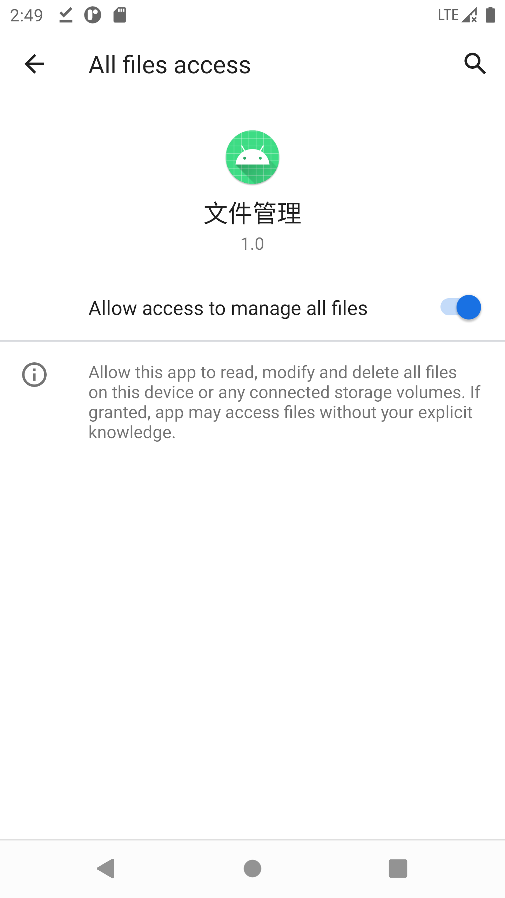
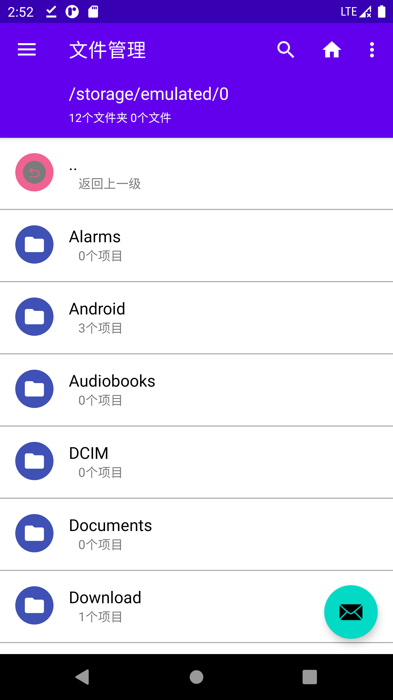

## task4 适配器与适配器控件设计

本章任务是把文件列表显示在文件容器的控件上。

### 4.1 创建MainFragment和相关布局文件

#### 1. 创建MainFragment

右键点击fragments文件夹，依次点击New->Fragment->Fragment(Blank)创建一个MainFragment用于显示文件的容器。如果没有fragments，请在pub.renge.filemanage下创建一个新的包，方法是New->package。

创建好MainFragment后，系统会自动生成一个fragment_main.xml文件。

修改fragment_main.xml，在其中放入SwipeRefreshLayout（此布局控件用于下拉刷新），然后在该布局中放入RecyclerView（用于大数据量展示，用于替代ListView），具体代码如下：

```xml
<?xml version="1.0" encoding="utf-8"?>
<FrameLayout xmlns:android="http://schemas.android.com/apk/res/android"
    xmlns:tools="http://schemas.android.com/tools"
    android:layout_width="match_parent"
    android:layout_height="match_parent"
    tools:context=".fragments.MainFragment">

    <!-- TODO: Update blank fragment layout -->
    <androidx.swiperefreshlayout.widget.SwipeRefreshLayout
        android:id="@+id/activity_main_swipe_refresh_layout"
        android:layout_width="match_parent"
        android:layout_height="wrap_content">

        <androidx.recyclerview.widget.RecyclerView
            android:id="@+id/listView"
            android:layout_width="match_parent"
            android:layout_height="match_parent"
            android:divider="@null"
            android:scrollbars="none" />

    </androidx.swiperefreshlayout.widget.SwipeRefreshLayout >

</FrameLayout>
```


#### 2. 修改content_main.xml

这个文件用于显示Fragment。系统生成的里面会用到一个navGraph的新功能，这里我们不需要这个功能，把文件中app:navGraph="@navigation/mobile_navigation" 这行删掉即可，删除完之后的代码如下：

```xml
<?xml version="1.0" encoding="utf-8"?>
<androidx.constraintlayout.widget.ConstraintLayout xmlns:android="http://schemas.android.com/apk/res/android"
    xmlns:app="http://schemas.android.com/apk/res-auto"
    xmlns:tools="http://schemas.android.com/tools"
    android:layout_width="match_parent"
    android:layout_height="match_parent"
    app:layout_behavior="@string/appbar_scrolling_view_behavior"
    tools:showIn="@layout/app_bar_main">

    <fragment
        android:id="@+id/nav_host_fragment"
        android:name="androidx.navigation.fragment.NavHostFragment"
        android:layout_width="match_parent"
        android:layout_height="match_parent"
        app:defaultNavHost="true"
        app:layout_constraintLeft_toLeftOf="parent"
        app:layout_constraintRight_toRightOf="parent"
        app:layout_constraintTop_toTopOf="parent"
        />
</androidx.constraintlayout.widget.ConstraintLayout>
```


#### 3. 创建类RoundedImageView

创建类RoundedImageView，实现快速将图片变成圆角，包名pub.renge.manage.ui.views。具体代码如下：

```java
package pub.renge.filemanage.ui.views;

import android.content.Context;
import android.graphics.Bitmap;
import android.graphics.Canvas;
import android.graphics.Color;
import android.graphics.Paint;
import android.graphics.PorterDuff;
import android.graphics.PorterDuffXfermode;
import android.graphics.Rect;
import android.graphics.drawable.BitmapDrawable;
import android.graphics.drawable.Drawable;
import android.util.AttributeSet;

import androidx.appcompat.widget.AppCompatImageView;


public class RoundedImageView extends AppCompatImageView {

    public RoundedImageView(Context ctx, AttributeSet attrs) {
        super(ctx, attrs);
    }

    @Override
    protected void onDraw(Canvas canvas) {

        Drawable drawable = getDrawable();

        if (drawable == null) {
            return;
        }

        if (getWidth() == 0 || getHeight() == 0) {
            return;
        }
        Bitmap b = ((BitmapDrawable) drawable).getBitmap();
        Bitmap bitmap = b.copy(Bitmap.Config.ARGB_8888, true);

        int w = getWidth(), h = getHeight();

        Bitmap roundBitmap = getRoundedCroppedBitmap(bitmap, w);
        canvas.drawBitmap(roundBitmap, 0, 0, null);

    }

    public static Bitmap getRoundedCroppedBitmap(Bitmap bitmap, int radius) {
        Bitmap finalBitmap;
        if (bitmap.getWidth() != radius || bitmap.getHeight() != radius)
            finalBitmap = Bitmap.createScaledBitmap(bitmap, radius, radius,
                    false);
        else
            finalBitmap = bitmap;
        Bitmap output = Bitmap.createBitmap(finalBitmap.getWidth(),
                finalBitmap.getHeight(), Bitmap.Config.ARGB_8888);
        Canvas canvas = new Canvas(output);

        final Paint paint = new Paint();
        final Rect rect = new Rect(0, 0, finalBitmap.getWidth(),
                finalBitmap.getHeight());

        paint.setAntiAlias(true);
        paint.setFilterBitmap(true);
        paint.setDither(true);
        canvas.drawARGB(0, 0, 0, 0);
        paint.setColor(Color.parseColor("#BAB399"));
        canvas.drawCircle(finalBitmap.getWidth() / 2 + 0.7f,
                finalBitmap.getHeight() / 2 + 0.7f,
                finalBitmap.getWidth() / 2 + 0.1f, paint);
        paint.setXfermode(new PorterDuffXfermode(PorterDuff.Mode.SRC_IN));
        canvas.drawBitmap(finalBitmap, rect, rect, paint);

        return output;
    }

}
```


#### 4. 创建类CircleGradientDrawable

创建类CircleGradientDrawable，实现自定义的选择效果，包名pub.renge.filemanage.ui.views。具体代码如下：

```java
package pub.renge.filemanage.ui.views;

import android.graphics.Color;
import android.graphics.drawable.GradientDrawable;
import android.util.DisplayMetrics;

public class CircleGradientDrawable extends GradientDrawable {

    private static final int STROKE_WIDTH = 2;
    private static final String STROKE_COLOR_LIGHT = "#EEEEEE";
    private static final String STROKE_COLOR_DARK = "#424242";
    private DisplayMetrics mDisplayMetrics;

    /**
     * Constructor
     * @param color the hex color of circular icon
     * @param theme current theme light/dark which will determine the boundary color
     * @param metrics to convert the boundary width for {@link #setStroke} method from dp to px
     */
    public CircleGradientDrawable(String color, int theme, DisplayMetrics metrics) {
        this.mDisplayMetrics = metrics;
        setShape(OVAL);
        setSize(1, 1);
        setColor(Color.parseColor(color));
        setStroke(dpToPx(STROKE_WIDTH), (theme == 1) ? Color.parseColor(STROKE_COLOR_DARK)
                : Color.parseColor(STROKE_COLOR_LIGHT));
    }

    private int dpToPx(int dp) {
        int px = Math.round(dp * mDisplayMetrics.xdpi/mDisplayMetrics.DENSITY_DEFAULT);
        return px;
    }
}
```


#### 5. 创建文件列表显示布局

在layout中添加布局文件list_header.xml实现头部效果，右键点击res->layout，然后选择new->Layout Resource File，名称为list_header，具体代码如下：

```xml
<?xml version="1.0" encoding="utf-8"?>
<TextView xmlns:android="http://schemas.android.com/apk/res/android"
    android:layout_width="wrap_content"
    android:layout_height="match_parent"
    android:minHeight="48dp"
    android:id="@+id/headertext"
    android:fontFamily="sans-serif-medium"
    android:textSize="14sp"
    android:gravity="center_vertical"
    android:layout_gravity="center_vertical"
    android:paddingLeft="72dp"/>
```


在layout中添加布局文件list_footer.xml实现尾部效果，右键点击res->layout，然后选择new->Layout Resource File，名称为list_header，具体代码如下：

```xml
<RelativeLayout xmlns:android="http://schemas.android.com/apk/res/android"
    android:id="@+id/second"
    android:layout_width="match_parent"
    android:layout_height="wrap_content"
    android:clickable="true">

        <TextView
            android:paddingTop="32dp"
            android:id="@+id/firstline"
            android:layout_width="wrap_content"
            android:layout_height="wrap_content"
            android:layout_alignParentTop="true"
            android:textSize="13sp"
            android:textStyle="bold"
            android:textColor="?android:attr/textColorTertiary"
            android:layout_centerInParent="true"
            android:fontFamily="sans-serif-light"/>

</RelativeLayout>
```


在layout添加布局文件list_item.xml实现列表项的显示，右键点击res->layout，然后选择new->Layout Resource File，名称为list_item，具体代码如下：

```xml
<?xml version="1.0" encoding="utf-8"?>
<RelativeLayout xmlns:android="http://schemas.android.com/apk/res/android"
    android:id="@+id/second"
    android:layout_width="match_parent"
    android:layout_height="wrap_content"
    android:clickable="true"
    android:minHeight="@dimen/minimal_row_size"
    android:paddingLeft="@dimen/minimal_material_padding"
    android:paddingRight="@dimen/minimal_material_padding">

    <RelativeLayout
        android:id="@+id/icon_frame_parent"
        android:layout_width="@dimen/minimal_icon_parent_width"
        android:layout_height="@dimen/minimal_row_size"
        android:layout_alignParentLeft="true"
        android:layout_alignParentStart="true">

        <FrameLayout
            android:id="@+id/iconframe"
            android:layout_width="wrap_content"
            android:layout_height="wrap_content"
            android:layout_marginTop="@dimen/icon_margin_top">

            <ImageView
                android:id="@+id/apk_icon"
                android:layout_width="@dimen/minimal_icon_size"
                android:layout_height="@dimen/minimal_icon_size"
                android:layout_gravity="center"
                android:scaleType="centerCrop"
                android:visibility="gone" />

            <pub.renge.filemanage.ui.views.RoundedImageView
                android:id="@+id/picture_icon"
                android:layout_width="@dimen/minimal_icon_size"
                android:layout_height="@dimen/minimal_icon_size"
                android:contentDescription="@string/icon"
                android:scaleType="centerCrop" />

            <ImageView
                android:id="@+id/generic_icon"
                android:layout_width="40dp"
                android:layout_height="40dp"
                android:layout_gravity="center_vertical"
                android:background="@drawable/circle_shape"
                android:padding="8dp" />

            <TextView
                android:id="@+id/generictext"
                android:layout_width="@dimen/minimal_icon_size"
                android:layout_height="@dimen/minimal_icon_size"
                android:layout_gravity="center"
                android:gravity="center"
                android:singleLine="true"
                android:textColor="@android:color/white"
                android:textSize="12dp"
                android:textStyle="bold" />
        </FrameLayout>

        <ImageView
            android:id="@+id/check_icon"
            android:layout_width="@dimen/tick_icon_size"
            android:layout_height="@dimen/tick_icon_size"
            android:layout_alignParentBottom="true"
            android:layout_alignParentRight="true"
            android:layout_marginBottom="@dimen/check_icon_margin_bottom_right"
            android:layout_marginRight="@dimen/check_icon_margin_bottom_right"
            android:padding="@dimen/check_icon_padding"
            android:src="@mipmap/ic_checkmark_selected"
            android:visibility="invisible" />
    </RelativeLayout>

    <RelativeLayout
        android:layout_width="match_parent"
        android:layout_height="wrap_content"
        android:layout_centerVertical="true"
        android:layout_toRightOf="@id/icon_frame_parent">

        <TextView
            android:id="@+id/firstLine"
            android:layout_width="wrap_content"
            android:layout_height="wrap_content"
            android:clickable="false"
            android:ellipsize="middle"
            android:gravity="center_vertical"
            android:singleLine="true"
            android:textColor="@android:color/black"
            android:textSize="17sp" />

        <RelativeLayout
            android:layout_width="wrap_content"
            android:layout_height="wrap_content"
            android:layout_below="@id/firstLine"
            android:layout_alignParentBottom="true"
            android:layout_alignParentStart="true">

            <TextView
                android:id="@+id/secondLine"
                android:layout_width="wrap_content"
                android:layout_height="wrap_content"
                android:layout_marginLeft="10dip"
                android:textColor="?android:attr/textColorTertiary"
                android:textSize="13sp" />
        </RelativeLayout>
    </RelativeLayout>

</RelativeLayout>
```


在layout添加布局文件grid_item.xml实现表格项的显示，右键点击res->layout，然后选择new->Layout Resource File，名称为grid_item，具体代码如下：

```xml
<?xml version="1.0" encoding="utf-8"?>
<FrameLayout xmlns:android="http://schemas.android.com/apk/res/android"
    android:id="@+id/second"
    android:layout_width="match_parent"
    android:layout_height="170dp"
    android:layout_margin="2dp"
    android:background="#ffffff">

    <LinearLayout
        android:layout_width="match_parent"
        android:layout_height="match_parent"
        android:orientation="vertical"
        android:paddingBottom="6dp">

        <FrameLayout
            android:id="@+id/icon_frame"
            android:layout_width="match_parent"
            android:layout_height="0dp"
            android:layout_marginBottom="6dp"
            android:layout_weight="1"
            android:background="#fff"
            android:foregroundGravity="fill">

            <RelativeLayout
                android:layout_width="match_parent"
                android:layout_height="match_parent"
                android:gravity="right|top">

                <ImageView
                    android:id="@+id/check_icon_grid"
                    android:layout_width="wrap_content"
                    android:layout_height="wrap_content"
                    android:layout_alignParentRight="true"
                    android:layout_alignParentTop="true"
                    android:layout_marginRight="@dimen/check_icon_margin_bottom_right"
                    android:layout_marginTop="@dimen/check_icon_margin_bottom_right"
                    android:background="@drawable/circle_shape"
                    android:padding="@dimen/check_icon_padding"
                    android:src="@mipmap/ic_checkmark_selected"
                    android:visibility="invisible" />
            </RelativeLayout>

            <ImageView
                android:id="@+id/generic_icon"
                android:layout_width="65dp"
                android:layout_height="65dp"
                android:layout_gravity="center"
                android:contentDescription="@null"
                android:scaleType="centerInside" />

            <ImageView
                android:id="@+id/icon_thumb"
                android:layout_width="match_parent"
                android:layout_height="match_parent"
                android:contentDescription="@null"
                android:scaleType="centerCrop" />


        </FrameLayout>

        <RelativeLayout
            android:layout_width="match_parent"
            android:layout_height="wrap_content">

            <LinearLayout
                android:id="@+id/line1"
                android:layout_width="match_parent"
                android:layout_height="35dp"
                android:baselineAligned="false"
                android:gravity="center_vertical"
                android:orientation="horizontal">

                <TextView
                    android:id="@+id/firstLine"
                    style="@android:style/TextAppearance.Medium"
                    android:layout_width="match_parent"
                    android:layout_height="wrap_content"
                    android:layout_gravity="start|center_vertical"
                    android:ellipsize="middle"
                    android:paddingLeft="5dp"
                    android:textAlignment="viewStart"
                    android:textColor="@android:color/black"
                    android:textSize="14dp"
                    android:singleLine="true" />

            </LinearLayout>

            <RelativeLayout
                android:id="@+id/line2"
                android:layout_width="match_parent"
                android:layout_height="wrap_content"
                android:layout_below="@id/line1"
                android:baselineAligned="false"
                android:gravity="center_vertical"
                android:orientation="horizontal">

                <TextView
                    android:id="@+id/secondLine"
                    style="@android:style/TextAppearance.Small"
                    android:layout_width="wrap_content"
                    android:layout_height="wrap_content"
                    android:layout_alignParentRight="true"
                    android:ellipsize="end"
                    android:maxLines="1"
                    android:paddingLeft="5dp"
                    android:paddingRight="5dp"
                    android:textSize="12dp" />

            </RelativeLayout>
        </RelativeLayout>
    </LinearLayout>
</FrameLayout>
```


#### 6. 创建菜单

创建菜单项action_mode_menu,当选择文件的时候可以做什么，右键点击res->menu，依次选择New->Menu Resource File，名称填写action_mode_menu。具体代码如下：


### 4.2 创建相关基础类


#### 1. 引用新的库

在本案例中会用到第三方的对话框组件MaterialDialog，所以要引入第三方依赖，我们需要在build.gradle(Module)文件中的dependencies下加入：

```xml
implementation 'com.timehop.stickyheadersrecyclerview:library:0.4.3'
implementation 'com.afollestad.material-dialogs:core:3.3.0'
implementation 'com.afollestad.material-dialogs:input:3.3.0'
implementation 'com.afollestad.material-dialogs:files:3.3.0'
implementation 'com.afollestad.material-dialogs:color:3.3.0'
implementation 'com.afollestad.material-dialogs:datetime:3.3.0'
implementation 'com.afollestad.material-dialogs:bottomsheets:3.3.0'
implementation 'com.afollestad.material-dialogs:lifecycle:3.3.0'
```

重新sync project即可。


#### 2. 创建类MimeTypes

创建MimeTypes类对媒体类型进行管理。创建MimeTypes类，修改包名为pub.renge.filemanage.ui.icons。具体代码如下：

```java
package pub.renge.filemanage.ui.icons;

import android.webkit.MimeTypeMap;

import java.io.File;
import java.util.HashMap;
import java.util.Locale;
import java.util.regex.Pattern;

public final class MimeTypes {

    public static final String ALL_MIME_TYPES = "*/*";


    private static final HashMap<String, String> MIME_TYPES = new HashMap<String, String>();

    private MimeTypes() {

    }

    static {
        /*
         * ================= MIME TYPES ====================
         */
        MIME_TYPES.put("asm", "text/x-asm");
        MIME_TYPES.put("def", "text/plain");
        MIME_TYPES.put("in", "text/plain");
        MIME_TYPES.put("rc", "text/plain");
        MIME_TYPES.put("list", "text/plain");
        MIME_TYPES.put("log", "text/plain");
        MIME_TYPES.put("pl", "text/plain");
        MIME_TYPES.put("prop", "text/plain");
        MIME_TYPES.put("properties", "text/plain");
        MIME_TYPES.put("rc", "text/plain");

        MIME_TYPES.put("epub", "application/epub+zip");
        MIME_TYPES.put("ibooks", "application/x-ibooks+zip");

        MIME_TYPES.put("ifb", "text/calendar");
        MIME_TYPES.put("eml", "message/rfc822");
        MIME_TYPES.put("msg", "application/vnd.ms-outlook");

        MIME_TYPES.put("ace", "application/x-ace-compressed");
        MIME_TYPES.put("bz", "application/x-bzip");
        MIME_TYPES.put("bz2", "application/x-bzip2");
        MIME_TYPES.put("cab", "application/vnd.ms-cab-compressed");
        MIME_TYPES.put("gz", "application/x-gzip");
        MIME_TYPES.put("lrf", "application/octet-stream");
        MIME_TYPES.put("jar", "application/java-archive");
        MIME_TYPES.put("xz", "application/x-xz");
        MIME_TYPES.put("Z", "application/x-compress");

        MIME_TYPES.put("bat", "application/x-msdownload");
        MIME_TYPES.put("ksh", "text/plain");
        MIME_TYPES.put("sh", "application/x-sh");

        MIME_TYPES.put("db", "application/octet-stream");
        MIME_TYPES.put("db3", "application/octet-stream");

        MIME_TYPES.put("otf", "application/x-font-otf");
        MIME_TYPES.put("ttf", "application/x-font-ttf");
        MIME_TYPES.put("psf", "application/x-font-linux-psf");

        MIME_TYPES.put("cgm", "image/cgm");
        MIME_TYPES.put("btif", "image/prs.btif");
        MIME_TYPES.put("dwg", "image/vnd.dwg");
        MIME_TYPES.put("dxf", "image/vnd.dxf");
        MIME_TYPES.put("fbs", "image/vnd.fastbidsheet");
        MIME_TYPES.put("fpx", "image/vnd.fpx");
        MIME_TYPES.put("fst", "image/vnd.fst");
        MIME_TYPES.put("mdi", "image/vnd.ms-mdi");
        MIME_TYPES.put("npx", "image/vnd.net-fpx");
        MIME_TYPES.put("xif", "image/vnd.xiff");
        MIME_TYPES.put("pct", "image/x-pict");
        MIME_TYPES.put("pic", "image/x-pict");

        MIME_TYPES.put("adp", "audio/adpcm");
        MIME_TYPES.put("au", "audio/basic");
        MIME_TYPES.put("snd", "audio/basic");
        MIME_TYPES.put("m2a", "audio/mpeg");
        MIME_TYPES.put("m3a", "audio/mpeg");
        MIME_TYPES.put("oga", "audio/ogg");
        MIME_TYPES.put("spx", "audio/ogg");
        MIME_TYPES.put("aac", "audio/x-aac");
        MIME_TYPES.put("mka", "audio/x-matroska");

        MIME_TYPES.put("jpgv", "video/jpeg");
        MIME_TYPES.put("jpgm", "video/jpm");
        MIME_TYPES.put("jpm", "video/jpm");
        MIME_TYPES.put("mj2", "video/mj2");
        MIME_TYPES.put("mjp2", "video/mj2");
        MIME_TYPES.put("mpa", "video/mpeg");
        MIME_TYPES.put("ogv", "video/ogg");
        MIME_TYPES.put("flv", "video/x-flv");
        MIME_TYPES.put("mkv", "video/x-matroska");

    }


    public static String getMimeType(File file) {
        if (file.isDirectory()) {
            return null;
        }

        String type = "*/*";
        final String extension = getExtension(file.getName());

        if (extension != null && !extension.isEmpty()) {
            final String extensionLowerCase = extension.toLowerCase(Locale
                    .getDefault());
            final MimeTypeMap mime = MimeTypeMap.getSingleton();
            type = mime.getMimeTypeFromExtension(extensionLowerCase);
            if (type == null) {
                type = MIME_TYPES.get(extensionLowerCase);
            }
        }
        if(type==null)type="*/*";
        return type;
    }

    public static boolean mimeTypeMatch(String mime, String input) {
        return Pattern.matches(mime.replace("*", ".*"), input);
    }


    public static String getExtension(String a) {
        if(a.contains("."))
            return a.substring(a.lastIndexOf(".") + 1).toLowerCase();
        else return "";
    }

}
```


#### 3. 创建类Icons

创建Icons类来对所有的图标进行处理。创建Icons类，修改包名为pub.renge.filemanage.ui.icons。具体代码如下：

```java
package pub.renge.filemanage.ui.icons;

import android.content.Context;
import android.content.res.Resources;
import android.graphics.drawable.Drawable;

import java.io.File;
import java.util.HashMap;

import pub.renge.filemanage.R;

public class Icons {
    private static HashMap<String, Integer> sMimeIcons = new HashMap<String, Integer>();
    private static void add(String mimeType, int resId) {
        if (sMimeIcons.put(mimeType, resId) != null) {
            throw new RuntimeException(mimeType + " already registered!");
        }
    }
    static {
        int icon;

        // Package
        icon = R.mipmap.ic_doc_apk_white;
        add("application/vnd.android.package-archive", icon);

        // Audio
        icon = R.mipmap.ic_doc_audio_am;
        add("application/ogg", icon);
        add("application/x-flac", icon);

        // Certificate
        icon = R.mipmap.ic_doc_certificate;
        add("application/pgp-keys", icon);
        add("application/pgp-signature", icon);
        add("application/x-pkcs12", icon);
        add("application/x-pkcs7-certreqresp", icon);
        add("application/x-pkcs7-crl", icon);
        add("application/x-x509-ca-cert", icon);
        add("application/x-x509-user-cert", icon);
        add("application/x-pkcs7-certificates", icon);
        add("application/x-pkcs7-mime", icon);
        add("application/x-pkcs7-signature", icon);

        // Source code
        icon = R.mipmap.ic_doc_codes;
        add("application/rdf+xml", icon);
        add("application/rss+xml", icon);
        add("application/x-object", icon);
        add("application/xhtml+xml", icon);
        add("text/css", icon);
        add("text/html", icon);
        add("text/xml", icon);
        add("text/x-c++hdr", icon);
        add("text/x-c++src", icon);
        add("text/x-chdr", icon);
        add("text/x-csrc", icon);
        add("text/x-dsrc", icon);
        add("text/x-csh", icon);
        add("text/x-haskell", icon);
        add("text/x-java", icon);
        add("text/x-literate-haskell", icon);
        add("text/x-pascal", icon);
        add("text/x-tcl", icon);
        add("text/x-tex", icon);
        add("application/x-latex", icon);
        add("application/x-texinfo", icon);
        add("application/atom+xml", icon);
        add("application/ecmascript", icon);
        add("application/json", icon);
        add("application/javascript", icon);
        add("application/xml", icon);
        add("text/javascript", icon);
        add("application/x-javascript", icon);

        // Compressed
        icon = R.mipmap.ic_doc_compressed;
        add("application/mac-binhex40", icon);
        add("application/rar", icon);
        add("application/zip", icon);
        add("application/java-archive",icon);
        add("application/x-apple-diskimage", icon);
        add("application/x-debian-package", icon);
        add("application/x-gtar", icon);
        add("application/x-iso9660-image", icon);
        add("application/x-lha", icon);
        add("application/x-lzh", icon);
        add("application/x-lzx", icon);
        add("application/x-stuffit", icon);
        add("application/x-tar", icon);
        add("application/x-webarchive", icon);
        add("application/x-webarchive-xml", icon);
        add("application/gzip", icon);
        add("application/x-7z-compressed", icon);
        add("application/x-deb", icon);
        add("application/x-rar-compressed", icon);

        // Contact
        icon = R.mipmap.ic_doc_contact_am;
        add("text/x-vcard", icon);
        add("text/vcard", icon);

        // Event
        icon = R.mipmap.ic_doc_event_am;
        add("text/calendar", icon);
        add("text/x-vcalendar", icon);

        // Font
        icon = R.mipmap.ic_doc_font;
        add("application/x-font", icon);
        add("application/font-woff", icon);
        add("application/x-font-woff", icon);
        add("application/x-font-ttf", icon);

        // Image
        icon = R.mipmap.ic_doc_image;
        add("application/vnd.oasis.opendocument.graphics", icon);
        add("application/vnd.oasis.opendocument.graphics-template", icon);
        add("application/vnd.oasis.opendocument.image", icon);
        add("application/vnd.stardivision.draw", icon);
        add("application/vnd.sun.xml.draw", icon);
        add("application/vnd.sun.xml.draw.template", icon);
        add("image/jpeg", icon);
        add("image/png", icon);
        // PDF
        icon = R.mipmap.ic_doc_pdf;
        add("application/pdf", icon);

        // Presentation
        icon = R.mipmap.ic_doc_presentation;
        add("application/vnd.ms-powerpoint", icon);
        add("application/vnd.openxmlformats-officedocument.presentationml.presentation", icon);
        add("application/vnd.openxmlformats-officedocument.presentationml.template", icon);
        add("application/vnd.openxmlformats-officedocument.presentationml.slideshow", icon);
        add("application/vnd.stardivision.impress", icon);
        add("application/vnd.sun.xml.impress", icon);
        add("application/vnd.sun.xml.impress.template", icon);
        add("application/x-kpresenter", icon);
        add("application/vnd.oasis.opendocument.presentation", icon);

        // Spreadsheet
        icon = R.mipmap.ic_doc_spreadsheet_am;
        add("application/vnd.oasis.opendocument.spreadsheet", icon);
        add("application/vnd.oasis.opendocument.spreadsheet-template", icon);
        add("application/vnd.ms-excel", icon);
        add("application/vnd.openxmlformats-officedocument.spreadsheetml.sheet", icon);
        add("application/vnd.openxmlformats-officedocument.spreadsheetml.template", icon);
        add("application/vnd.stardivision.calc", icon);
        add("application/vnd.sun.xml.calc", icon);
        add("application/vnd.sun.xml.calc.template", icon);
        add("application/x-kspread", icon);

        // Doc
        icon = R.mipmap.ic_doc_doc_am;
        add("application/msword", icon);
        add("application/vnd.openxmlformats-officedocument.wordprocessingml.document", icon);
        add("application/vnd.openxmlformats-officedocument.wordprocessingml.template", icon);
        add("application/vnd.oasis.opendocument.text", icon);
        add("application/vnd.oasis.opendocument.text-master", icon);
        add("application/vnd.oasis.opendocument.text-template", icon);
        add("application/vnd.oasis.opendocument.text-web", icon);
        add("application/vnd.stardivision.writer", icon);
        add("application/vnd.stardivision.writer-global", icon);
        add("application/vnd.sun.xml.writer", icon);
        add("application/vnd.sun.xml.writer.global", icon);
        add("application/vnd.sun.xml.writer.template", icon);
        add("application/x-abiword", icon);
        add("application/x-kword", icon);

        // Text
        icon = R.mipmap.ic_doc_text_am;
        add("text/plain", icon);

        // Video
        icon = R.mipmap.ic_doc_video_am;
        add("application/x-quicktimeplayer", icon);
        add("application/x-shockwave-flash", icon);
    }

    public static boolean isText(String name) {
        String mimeType=MimeTypes.getMimeType(new File(name));

        Integer res = sMimeIcons.get(mimeType);
        if (res != null && res == R.mipmap.ic_doc_text_am) return true;
        if(mimeType!=null && mimeType.contains("/")){
            final String typeOnly = mimeType.split("/")[0];
            if ("text".equals(typeOnly)) {
                return true;}}
        return false;
    }
    public static boolean isVideo(String name){
        String mimeType=MimeTypes.getMimeType(new File(name));
        Integer res = sMimeIcons.get(mimeType);
        if (res != null && res == R.mipmap.ic_doc_video_am) return true;
        if(mimeType!=null && mimeType.contains("/")){
            final String typeOnly = mimeType.split("/")[0];
            if ("video".equals(typeOnly)) {
                return true;}}
        return false;
    }
    public static boolean isAudio(String name){
        String mimeType=MimeTypes.getMimeType(new File(name));
        Integer res = sMimeIcons.get(mimeType);
        if (res != null && res == R.mipmap.ic_doc_audio_am) return true;
        if(mimeType!=null && mimeType.contains("/")){
            final String typeOnly = mimeType.split("/")[0];
            if ("audio".equals(typeOnly)) {
                return true;}}
        return false;
    }
    public static boolean isCode(String name) {
        Integer res = sMimeIcons.get(MimeTypes.getMimeType(new File(name)));
        if (res != null && res == R.mipmap.ic_doc_codes) return true;
        return false;
    }
    public static boolean isArchive(String name) {
        Integer res = sMimeIcons.get(MimeTypes.getMimeType(new File(name)));
        if (res != null && res == R.mipmap.ic_doc_compressed) return true;
        return false;
    }

    public static boolean isApk(String name) {
        Integer res = sMimeIcons.get(MimeTypes.getMimeType(new File(name)));
        if (res != null && res == R.mipmap.ic_doc_apk_white) return true;
        return false;
    }
    public static boolean isPdf(String name) {
        Integer res = sMimeIcons.get(MimeTypes.getMimeType(new File(name)));
        if (res != null && res == R.mipmap.ic_doc_pdf) return true;
        return false;
    }

    public static boolean isPicture(String name) {
        Integer res = sMimeIcons.get(MimeTypes.getMimeType(new File(name)));
        if (res != null && res == R.mipmap.ic_doc_image) return true;
        return false;
    }
    public static boolean isgeneric(String name){
        String mimeType = MimeTypes.getMimeType(new File(name));
        if (mimeType == null) {
            return true;
        }
        Integer resId = sMimeIcons.get(mimeType);
        if(resId==null){return true;}


        return false;}
    public static Drawable loadMimeIcon(Context context, String path, boolean grid, final Resources res) {
        String mimeType = MimeTypes.getMimeType(new File(path));
        if (mimeType == null) {
            /* if(grid)
            return res.getDrawable(R.mipmap.ic_doc_generic_am_grid);
*/
            return res.getDrawable(R.mipmap.ic_doc_generic_am);
        }


        // Look for exact match first
        Integer resId = sMimeIcons.get(mimeType);

        if (resId != null) {switch (resId){
            case R.mipmap.ic_doc_apk_white: if(grid)resId= R.mipmap.ic_doc_apk_grid;
                break;/*
            case R.mipmap.ic_doc_audio_am: if(grid)resId=R.mipmap.ic_doc_audio_am_grid;
                break;
            case R.mipmap.ic_doc_certificate: if(grid)resId=R.mipmap.ic_doc_certificate_grid;
                break;
            case R.mipmap.ic_doc_codes: if(grid)resId=R.mipmap.ic_doc_codes_grid;
                break;
            case R.mipmap.ic_doc_font: if(grid)resId=R.mipmap.ic_doc_font_grid;
                break;
            case R.mipmap.ic_doc_generic_am: if(grid)resId=R.mipmap.ic_doc_generic_am_grid;
                break;
            */case R.mipmap.ic_doc_image: if(grid)resId= R.mipmap.ic_doc_image_grid;
                break;}
            /*case R.mipmap.ic_doc_pdf: if(grid)resId=R.mipmap.ic_doc_pdf_grid;
                break;
            case R.mipmap.ic_doc_video_am: if(grid)resId=R.mipmap.ic_doc_video_am_grid;
                break;
            case R.mipmap.ic_doc_text_am: if(grid)resId=R.mipmap.ic_doc_text_am_grid;
                break;
        }*/
            return res.getDrawable(resId);
        }


        // Otherwise look for partial match
        final String typeOnly = mimeType.split("/")[0];
        if ("audio".equals(typeOnly)) {
            /* if(grid)return res.getDrawable(R.mipmap.ic_doc_audio_am_grid);else*/ return res.getDrawable(R.mipmap.ic_doc_audio_am);
        } else if ("image".equals(typeOnly)) {
            if(grid)return res.getDrawable(R.mipmap.ic_doc_image_grid);else return res.getDrawable(R.mipmap.ic_doc_image);
        } else if ("text".equals(typeOnly)) {
            /*if(grid)return res.getDrawable(R.mipmap.ic_doc_text_am_grid);else*/ return res.getDrawable(R.mipmap.ic_doc_text_am);
        } else if ("video".equals(typeOnly)) {
            /*if(grid)return res.getDrawable(R.mipmap.ic_doc_video_am_grid);else*/ return res.getDrawable(R.mipmap.ic_doc_video_am);
        }
        /*if(grid)return res.getDrawable(R.mipmap.ic_doc_generic_am_grid);else*/ return res.getDrawable(R.mipmap.ic_doc_generic_am);
    }
}
```


#### 4. 创建类FileHelper

在utils下创建类FileHelper，修改包名为pub.renge.filemanage.utils。具体代码如下：

```java
package pub.renge.filemanage.utils;

import android.content.ActivityNotFoundException;
import android.content.ContentResolver;
import android.content.Context;
import android.content.Intent;
import android.database.Cursor;
import android.graphics.BitmapFactory;
import android.net.Uri;
import android.provider.BaseColumns;
import android.provider.MediaStore;
import android.text.TextUtils;
import android.widget.Toast;

import com.afollestad.materialdialogs.MaterialDialog;
import com.afollestad.materialdialogs.list.DialogSingleChoiceExtKt;

import java.io.File;
import java.util.Arrays;

import pub.renge.filemanage.MainActivity;
import pub.renge.filemanage.R;
import pub.renge.filemanage.ui.icons.Icons;
import pub.renge.filemanage.ui.icons.MimeTypes;

public class FileHelper {

    private static final String INTERNAL_VOLUME = "internal";
    public static final String EXTERNAL_VOLUME = "external";

    private static final String EMULATED_STORAGE_SOURCE = System.getenv("EMULATED_STORAGE_SOURCE");
    private static final String EMULATED_STORAGE_TARGET = System.getenv("EMULATED_STORAGE_TARGET");
    private static final String EXTERNAL_STORAGE = System.getenv("EXTERNAL_STORAGE");

    /**
     * 计算图片的缩放比例，避免OOM
     *
     * @param options
     * @param reqWidth
     * @param reqHeight
     * @return
     */
    public static int calculateInSampleSize(BitmapFactory.Options options,
                                     int reqWidth, int reqHeight) {
        // Raw height and width of image
        final int height = options.outHeight;
        final int width = options.outWidth;
        int inSampleSize = 1;

        if (height > reqHeight || width > reqWidth) {

            final int halfHeight = height / 2;
            final int halfWidth = width / 2;

            // Calculate the largest inSampleSize value that is a power of 2 and
            // keeps both
            // height and width larger than the requested height and width.
            while ((halfHeight / inSampleSize) > reqHeight
                    && (halfWidth / inSampleSize) > reqWidth) {
                inSampleSize *= 2;
            }
        }

        return inSampleSize;
    }

    /**
     * 格式化文件大小
     *
     * @param f
     * @return
     */
    public static String getFileSize(File f) {
        int sub_index = 0;
        String show = "";
        if (f.isFile()) {
            long length = f.length();
            if (length >= 1073741824) {
                sub_index = (String.valueOf((float) length / 1073741824))
                        .indexOf(".");
                show = ((float) length / 1073741824 + "000").substring(0,
                        sub_index + 3) + "GB";
            } else if (length >= 1048576) {
                sub_index = (String.valueOf((float) length / 1048576))
                        .indexOf(".");
                show = ((float) length / 1048576 + "000").substring(0,
                        sub_index + 3) + "MB";
            } else if (length >= 1024) {
                sub_index = (String.valueOf((float) length / 1024))
                        .indexOf(".");
                show = ((float) length / 1024 + "000").substring(0,
                        sub_index + 3) + "KB";
            } else if (length < 1024) {
                show = String.valueOf(length) + "B";
            }
        } else {
            show = "";
        }

        return show;
    }

    /**
     * 打开文件
     *
     * @param f
     * @param m
     */
    public void openFile(final File f, final MainActivity m) {
        try {
            openunknown(f, m, false);
        } catch (Exception e) {
            Toast.makeText(m, R.string.noappfound, Toast.LENGTH_LONG).show();
            openWith(f, m);
        }
    }

    public void openunknown(File f, Context c, boolean forcechooser) {
        Intent intent = new Intent();
        intent.setAction(Intent.ACTION_VIEW);

        String type = MimeTypes.getMimeType(f);
        if (type != null && type.trim().length() != 0 && !type.equals("*/*")) {
            Uri uri = fileToContentUri(c, f);
            if (uri == null) uri = Uri.fromFile(f);
            intent.setDataAndType(uri, type);
            Intent startIntent;
            if (forcechooser)
                startIntent = Intent.createChooser(intent, c.getResources().getString(R.string.openwith));
            else startIntent = intent;
            try {
                c.startActivity(startIntent);
            } catch (ActivityNotFoundException e) {
                e.printStackTrace();
                Toast.makeText(c, R.string.noappfound, Toast.LENGTH_SHORT).show();
                openWith(f, c);
            }
        } else {
            openWith(f, c);
        }
    }

    /**
     * 打开方式
     * @param file
     * @param context
     */
    public void openWith(final File file, final Context context) {
        MaterialDialog dialog = new MaterialDialog(context,MaterialDialog.getDEFAULT_BEHAVIOR());
        dialog.title(R.string.openas,null);

        String[] items = new String[]{getString(context, R.string.text), getString(context, R.string.image), getString(context, R.string.video), getString(context, R.string.audio), getString(context, R.string.other)};

        DialogSingleChoiceExtKt.listItemsSingleChoice(dialog,null, Arrays.asList(items),null,0,true,  (materialDialog, integer, charSequences) -> {
            Uri uri = fileToContentUri(context, file);
            if (uri == null) uri = Uri.fromFile(file);
            Intent intent = new Intent();
            intent.setAction(Intent.ACTION_VIEW);
            switch (integer) {
                case 0:
                    intent.setDataAndType(uri, "text/*");
                    break;
                case 1:
                    intent.setDataAndType(uri, "image/*");
                    break;
                case 2:
                    intent.setDataAndType(uri, "video/*");
                    break;
                case 3:
                    intent.setDataAndType(uri, "audio/*");
                    break;
                case 4:
                    intent.setDataAndType(uri, "*/*");
                    break;
            }
            try {
                context.startActivity(intent);
            } catch (Exception e) {
                Toast.makeText(context, R.string.noappfound, Toast.LENGTH_SHORT).show();
                openWith(file, context);
            }
            return null;
        });

        dialog.show();
    }

    public Uri fileToContentUri(Context context, File file) {
        // Normalize the path to ensure media search
        final String normalizedPath = normalizeMediaPath(file.getAbsolutePath());

        // Check in external and internal storages
        Uri uri = fileToContentUri(context, normalizedPath, EXTERNAL_VOLUME);
        if (uri != null) {
            return uri;
        }
        uri = fileToContentUri(context, normalizedPath, INTERNAL_VOLUME);
        if (uri != null) {
            return uri;
        }
        return null;
    }

    private static Uri fileToContentUri(Context context, String path, String volume) {
        String[] projection = null;
        final String where = MediaStore.MediaColumns.DATA + " = ?";
        Uri baseUri = MediaStore.Files.getContentUri(volume);
        boolean isMimeTypeImage = false, isMimeTypeVideo = false, isMimeTypeAudio = false;
        isMimeTypeImage = Icons.isPicture(path);
        if (!isMimeTypeImage) {
            isMimeTypeVideo = Icons.isVideo(path);
            if (!isMimeTypeVideo) {
                isMimeTypeAudio = Icons.isVideo(path);
            }
        }
        if (isMimeTypeImage || isMimeTypeVideo || isMimeTypeAudio) {
            projection = new String[]{BaseColumns._ID};
            if (isMimeTypeImage) {
                baseUri = MediaStore.Images.Media.EXTERNAL_CONTENT_URI;
            } else if (isMimeTypeVideo) {
                baseUri = MediaStore.Video.Media.EXTERNAL_CONTENT_URI;
            } else if (isMimeTypeAudio) {
                baseUri = MediaStore.Audio.Media.EXTERNAL_CONTENT_URI;
            }
        } else {
            projection = new String[]{BaseColumns._ID, MediaStore.Files.FileColumns.MEDIA_TYPE};
        }
        ContentResolver cr = context.getContentResolver();
        Cursor c = cr.query(baseUri, projection, where, new String[]{path}, null);
        try {
            if (c != null && c.moveToNext()) {
                boolean isValid = false;
                if (isMimeTypeImage || isMimeTypeVideo || isMimeTypeAudio) {
                    isValid = true;
                } else {
                    int type = c.getInt(c.getColumnIndexOrThrow(
                            MediaStore.Files.FileColumns.MEDIA_TYPE));
                    isValid = type != 0;
                }

                if (isValid) {
                    // Do not force to use content uri for no media files
                    long id = c.getLong(c.getColumnIndexOrThrow(BaseColumns._ID));
                    return Uri.withAppendedPath(baseUri, String.valueOf(id));
                }
            }
        } finally {
            if (c != null) {
                c.close();
            }
        }
        return null;
    }


    public static String normalizeMediaPath(String path) {
        // Retrieve all the paths and check that we have this environment vars
        if (TextUtils.isEmpty(EMULATED_STORAGE_SOURCE) ||
                TextUtils.isEmpty(EMULATED_STORAGE_TARGET) ||
                TextUtils.isEmpty(EXTERNAL_STORAGE)) {
            return path;
        }

        // We need to convert EMULATED_STORAGE_SOURCE -> EMULATED_STORAGE_TARGET
        if (path.startsWith(EMULATED_STORAGE_SOURCE)) {
            path = path.replace(EMULATED_STORAGE_SOURCE, EMULATED_STORAGE_TARGET);
        }
        return path;
    }

    private String getString(Context c, int resID) {
        return c.getResources().getString(resID);
    }
}


```


#### 5. 创建类IconHolder

创建新类IconHolder，修改包名为pub.renge.filemanage.ui.icons，具体代码如下：

```java
package pub.renge.filemanage.ui.icons;

/*
 * Copyright (C) 2014 Arpit Khurana <arpitkh96@gmail.com>
 *
 * This file is part of Amaze File Manager.
 *
 * Amaze File Manager is free software: you can redistribute it and/or modify
 * it under the terms of the GNU General Public License as published by
 * the Free Software Foundation, either version 3 of the License, or
 * (at your option) any later version.
 *
 * This program is distributed in the hope that it will be useful,
 * but WITHOUT ANY WARRANTY; without even the implied warranty of
 * MERCHANTABILITY or FITNESS FOR A PARTICULAR PURPOSE.  See the
 * GNU General Public License for more details.
 *
 * You should have received a copy of the GNU General Public License
 * along with this program.  If not, see <http://www.gnu.org/licenses/>.
 */

import android.content.Context;
import android.content.pm.PackageInfo;
import android.content.pm.PackageManager;
import android.content.res.Resources;
import android.graphics.Bitmap;
import android.graphics.BitmapFactory;
import android.graphics.drawable.BitmapDrawable;
import android.graphics.drawable.Drawable;
import android.media.ThumbnailUtils;
import android.os.Handler;
import android.os.HandlerThread;
import android.os.Looper;
import android.os.Message;
import android.provider.MediaStore;
import androidx.core.content.ContextCompat ;
import android.widget.ImageView;


import java.util.HashMap;
import java.util.LinkedHashMap;
import java.util.Map;

import pub.renge.filemanage.R;
import pub.renge.filemanage.utils.FileHelper;

/**
 * A class that holds icons for a more efficient access.
 */
public class IconHolder {

    private static final int MAX_CACHE = 500;

    private static final int MSG_LOAD = 1;
    private static final int MSG_LOADED = 2;
    private static final int MSG_DESTROY = 3;

    private final Map<String, Bitmap> mIcons;     // Themes based
    private final Map<String, Bitmap> mAppIcons;  // App based

    private Map<String, Long> mAlbums;      // Media albums

    private Map<ImageView, String> mRequests;

    private final Context mContext;
    private final boolean mUseThumbs;
    private HandlerThread mWorkerThread;
    private Handler mWorkerHandler;
    boolean grid;
    private static class LoadResult {
        String fso;
        Bitmap result;
    }

    private Handler mHandler = new Handler() {
        @Override
        public void handleMessage(Message msg) {
            switch (msg.what) {
                case MSG_LOADED:
                    processResult((LoadResult) msg.obj);
                    sendEmptyMessageDelayed(MSG_DESTROY, 3000);
                    break;
                case MSG_DESTROY:
                    shutdownWorker();
                    break;
            }
        }

        private void processResult(LoadResult result) {
            // Cache the new drawable
            final String filePath =(result.fso);
            mAppIcons.put(filePath, result.result);

            // find the request for it
            for (Map.Entry<ImageView, String> entry : mRequests.entrySet()) {
                final ImageView imageView = entry.getKey();
                final String fso = entry.getValue();
                if (fso == result.fso) {
                    imageView.setImageBitmap(result.result);
                    mRequests.remove(imageView);
                    break;
                }
            }
        }
    };

    /**
     * Constructor of <code>IconHolder</code>.
     *
     * @param useThumbs If thumbs of images, videos, apps, ... should be returned
     * instead of the default icon.
     */
    int px;
    public IconHolder(Context context, boolean useThumbs, boolean grid) {
        super();
        this.mContext = context;
        this.mUseThumbs = useThumbs;
        this.mRequests = new HashMap<ImageView, String>();
        this.mIcons = new HashMap<String,Bitmap>();
        this.mAppIcons = new LinkedHashMap<String, Bitmap>(MAX_CACHE, .75F, true) {
            private static final long serialVersionUID = 1L;
            @Override
            protected boolean removeEldestEntry(Entry<String, Bitmap> eldest) {
                return size() > MAX_CACHE;
            }
        };
        this.mAlbums = new HashMap<String, Long>();
        this.grid=grid;
        Resources res=mContext.getResources();
        int dp=50;
        if(grid){dp=150;}
        px = (int)(dp * (res.getDisplayMetrics().densityDpi / 160));

    }

    /**
     * Method that returns a drawable reference of a icon.
     *
     * @param resid The resource identifier
     * @return Drawable The drawable icon reference
     */

    /**
     * Method that returns a drawable reference of a FileSystemObject.
     *
     * @param iconView View to load the drawable into
     * @param fso The FileSystemObject reference
     * @param defaultIcon Drawable to be used in case no specific one could be found
     * @return Drawable The drawable reference
     */
    public void loadDrawable(ImageView iconView, final String fso, Drawable defaultIcon) {
        if (!mUseThumbs) {
            return;
        }

        // Is cached?
        final String filePath = fso;
        if (this.mAppIcons.containsKey(filePath)) {
            iconView.setImageBitmap(this.mAppIcons.get(filePath));
            return;
        }
        mRequests.put(iconView, fso);
        new Thread(new Runnable() {
            @Override
            public void run() {

                mHandler.removeMessages(MSG_DESTROY);
                if (mWorkerThread == null || mWorkerHandler==null) {
                    mWorkerThread = new HandlerThread("IconHolderLoader");
                    mWorkerThread.start();
                    mWorkerHandler = new WorkerHandler(mWorkerThread.getLooper());
                }
                Message msg = mWorkerHandler.obtainMessage(MSG_LOAD, fso);
                msg.sendToTarget();

            }
        }).start();    }

    /**
     * Cancel loading of a drawable for a certain ImageView.
     */
    public void cancelLoad(ImageView view) {
        String fso = mRequests.get(view);
        if (fso != null && mWorkerHandler != null) {
            mWorkerHandler.removeMessages(MSG_LOAD, fso);
        }
        mRequests.remove(view);
    }

    private class WorkerHandler extends Handler {
        public WorkerHandler(Looper looper) {
            super(looper);
        }

        @Override
        public void handleMessage(Message msg) {
            switch (msg.what) {
                case MSG_LOAD:
                    String fso = (String) msg.obj;
                    Bitmap d = loadDrawable(fso);
                    if (d != null) {
                        LoadResult result = new LoadResult();
                        result.fso = fso;
                        result.result = d;
                        mHandler.obtainMessage(MSG_LOADED, result).sendToTarget();
                    }
                    break;
            }
        }
    }
    private Bitmap loadDrawable(String fso) {
        final String filePath = (fso);

        try {
            if (Icons.isApk(filePath)) {
                return getAppDrawable(fso);
            }else if(Icons.isPicture(filePath)){
                return loadImage(fso);
            }else if(Icons.isVideo(filePath))
                return getVideoDrawable(fso);
        } catch (OutOfMemoryError outOfMemoryError) {
            cleanup();
            shutdownWorker();
        }

        return null;
    }
    private Bitmap getVideoDrawable(String path) throws OutOfMemoryError{

        try {
            Bitmap thumb = ThumbnailUtils.createVideoThumbnail(path,
                    MediaStore.Images.Thumbnails.MINI_KIND);
            return thumb;
        } catch (Exception e) {
            e.printStackTrace();
            return null;
        }
    }
    private Bitmap getAppDrawable(String path) throws OutOfMemoryError{
        Bitmap bitsat;
        try {
            PackageManager pm = mContext.getPackageManager();
            PackageInfo pi = pm.getPackageArchiveInfo(path, 0);
            // // the secret are these two lines....
            pi.applicationInfo.sourceDir = path;
            pi.applicationInfo.publicSourceDir = path;
            // //
            Drawable d = pi.applicationInfo.loadIcon(pm);

            Bitmap d1 = null;
            d1 = ((BitmapDrawable) d).getBitmap();
            bitsat = d1;
        } catch (Exception e) {
            Drawable apk = ContextCompat.getDrawable(mContext, R.mipmap.ic_doc_apk_grid);
            Bitmap apk1 = ((BitmapDrawable) apk).getBitmap();
            bitsat = apk1;
        }
        return bitsat;
    }


    public Bitmap loadImage(String path) throws OutOfMemoryError{
        Bitmap bitsat;

        try {
            BitmapFactory.Options options = new BitmapFactory.Options();
            options.inPreferredConfig= Bitmap.Config.ARGB_8888;
            options.inJustDecodeBounds = true;
            Bitmap b = BitmapFactory.decodeFile(path, options);

            options.inSampleSize = FileHelper.calculateInSampleSize(options, px, px);

            // Decode bitmap with inSampleSize set
            options.inJustDecodeBounds = false;

            Bitmap bit;
            bit= BitmapFactory.decodeFile(path, options);

            bitsat = bit;// decodeFile(path);//.createScaledBitmap(bits,imageViewReference.get().getHeight(),imageViewReference.get().getWidth(),true);
        } catch (Exception e) {
            Drawable img = ContextCompat.getDrawable(mContext, R.mipmap.ic_doc_image);
            Bitmap img1 = ((BitmapDrawable) img).getBitmap();
            bitsat = img1;
        }return bitsat;
    }

    /**
     * Method that returns a thumbnail of the album folder
     *
     * @param albumId The album identifier
     * @return Drawable The drawable or null if cannot be extracted
     */


    /**
     * Shut down worker thread
     */
    private void shutdownWorker() {
        if (mWorkerThread != null) {
            mWorkerThread.getLooper().quit();
            mWorkerHandler = null;
            mWorkerThread = null;
        }
    }

    /**
     * Free any resources used by this instance
     */
    public void cleanup() {
        this.mRequests.clear();
        this.mIcons.clear();
        this.mAppIcons.clear();

        shutdownWorker();
    }
}
```


#### 6. 创建文件类FileBean

在pub.renge.filemanage下创建类pub.renge.filemanage.bean.FileBean。依次点击File->New->Java Class，输入类名FileBean，点击确定即可。修改包名后，具体内容如下：

```java
package pub.renge.filemanage.pub.renge.filemanage.bean;

import android.graphics.drawable.Drawable;

import java.io.File;

public class FileBean {

    private File file; // 文件
    private Drawable imageId;// 文件图标
    private String name;// 文件名
    private String path;// 文件路径
    private String size;// 文件大小
    private String type;// 文件类型  0：返回按钮  1：文件夹  2：文件   3：存储卡
    private boolean isChecked;// 是否被选中

    public boolean isChecked() {
        return isChecked;
    }

    public void setChecked(boolean isChecked) {
        this.isChecked = isChecked;
    }

    public File getFile() {
        return file;
    }

    public void setFile(File file) {
        this.file = file;
    }

    public String getName() {
        return name;
    }

    public void setName(String name) {
        this.name = name;
    }

    public Drawable getImageId() {
        return imageId;
    }

    public void setImageId(Drawable imageId) {
        this.imageId = imageId;
    }

    public String getPath() {
        return path;
    }

    public void setPath(String path) {
        this.path = path;
    }

    public String getFileSize() {
        return size;
    }

    public void setFileSize(String fileSize) {
        this.size = fileSize;
    }

    public String getFileType() {
        return type;
    }

    public void setFileType(String type) {
        this.type = type;
    }
}
```


#### 7. 创建类FileListSorter

创建类FileListSorter用于对文件进行排序，包名为pub.renge.filemanage.utils。具体代码如下：

```java
package pub.renge.filemanage.utils;

import java.util.Comparator;

import pub.renge.filemanage.pub.renge.filemanage.bean.FileBean;
import pub.renge.filemanage.ui.icons.MimeTypes;

public class FileListSorter implements Comparator<FileBean> {
    int sort = 0;

    public FileListSorter(int sort) {
        this.sort = sort;
    }


    @Override
    public int compare(FileBean file1, FileBean file2) {

        switch (sort) {
            case 1:// 按名称
                return file1.getName().compareToIgnoreCase(file2.getName());

            case 2:// 按大小
                return new Long(file1.getFile().length()).intValue() - new Long(file2.getFile().length()).intValue();

            case 3:// 按类型
                String type1 = MimeTypes.getMimeType(file1.getFile());
                String type2 = MimeTypes.getMimeType(file2.getFile());
                return type1.compareToIgnoreCase(type2);

            case 4:// 按修改时间
                return new Long(file1.getFile().lastModified()).intValue() - new Long(file2.getFile().lastModified()).intValue();
        }
        return 0;
    }
}
```


### 4.3 创建适配器RecyclerAdapter并显示文件

#### 1. 获取文件权限

在Android中访问文件需要权限，本例需要获得文件的所有权限，需要在AndroidManifest.xml中间加入

```xml
<uses-permission android:name="android.permission.MANAGE_EXTERNAL_STORAGE" />
```

完整的如下所示：

```xml
<?xml version="1.0" encoding="utf-8"?>
<manifest xmlns:android="http://schemas.android.com/apk/res/android"
    package="pub.renge.filemanage">

    <uses-permission android:name="android.permission.MANAGE_EXTERNAL_STORAGE" />

    <application
        android:allowBackup="true"
        android:icon="@mipmap/ic_launcher"
        android:label="@string/app_name"
        android:roundIcon="@mipmap/ic_launcher_round"
        android:supportsRtl="true"
        android:theme="@style/Theme.FileManage">


        <activity android:name=".ProductTourActivity"
            android:theme="@style/Theme.AppCompat.NoActionBar" >
        </activity>
        <activity
            android:name=".MainActivity"
            android:configChanges="keyboardHidden|orientation|screenSize"
            android:label="@string/app_name"
            android:theme="@style/Theme.FileManage.NoActionBar">
            <intent-filter>
                <action android:name="android.intent.action.MAIN" />
                <category android:name="android.intent.category.LAUNCHER" />
            </intent-filter>
        </activity>
    </application>
</manifest>
```


这些权限都是非常重要的权限，所以我们需要在MainActivity中申请这些权限，只有用户手动确认了才算是真正获得了权限。我们在MainActivity类中添加函数RequestProviliges申请访问权限，具体代码如下：

```java
/**
 * 申请访问权限
 */
private void RequestProviliges()
{
    //申请文件访问权限
    if(!Environment.isExternalStorageManager()){
        Intent intent = new Intent(Settings.ACTION_MANAGE_ALL_FILES_ACCESS_PERMISSION);
        startActivity(intent);
    }
}
```

然后我们在onCreate方法中调用该方法，放在调用checkshowTutorial()之后。

#### 2. 创建RecyclerArrayAdapter类

创建RecyclerArrayAdapter类，这是个适配器的抽象类，包名为pub.renge.manage.adapters。具体代码如下：

```
package pub.renge.filemanage;

import androidx.recyclerview.widget.RecyclerView;

import java.util.ArrayList;
import java.util.Arrays;
import java.util.Collection;

abstract class RecyclerArrayAdapter<M, VH extends RecyclerView.ViewHolder>
        extends RecyclerView.Adapter<VH> {
    private ArrayList<M> items = new ArrayList<M>();

    public RecyclerArrayAdapter() {
        setHasStableIds(true);
    }

    public void add(M object) {
        items.add(object);
        notifyDataSetChanged();
    }

    public void add(int index, M object) {
        items.add(index, object);
        notifyDataSetChanged();
    }

    public void addAll(Collection<? extends M> collection) {
        if (collection != null) {
            items.addAll(collection);
            notifyDataSetChanged();
        }
    }

    public void addAll(M... items) {
        addAll(Arrays.asList(items));
    }

    public void clear() {
        items.clear();
        notifyDataSetChanged();
    }

    public void remove(M object) {
        items.remove(object);
        notifyDataSetChanged();
    }

    public M getItem(int position) {
        return items.get(position);
    }

    @Override
    public long getItemId(int position) {
        return position;
    }

    @Override
    public int getItemCount() {
        return items.size();
    }

    public abstract void onViewAttachedToWindow(VH holder);
}
```


#### 3. 创建类RecyclerAdapter

创建类RecyclerAdapter，包名为pub.renge.manage.adapter，功能是为RecyclerView提供数据。具体代码如下：

```java
public class RecyclerAdapter extends RecyclerArrayAdapter<String, RecyclerView.ViewHolder>
        implements StickyRecyclerHeadersAdapter<RecyclerView.ViewHolder> {
    MainFragment mainFragment;
    ArrayList<FileBean> items;
    Context context;
    private SparseBooleanArray myChecked = new SparseBooleanArray();
    ColorMatrixColorFilter colorMatrixColorFilter;
    LayoutInflater mInflater;
    int filetype = -1;
    int column, rowHeight;

    int grey_color;
    int c1, c2, c3, c4, c5, c6, c7, c8, c9;

    public RecyclerAdapter(MainFragment m, ArrayList<FileBean> items, Context context) {
        this.mainFragment = m;
        this.items = items;
        this.context = context;

        for (int i = 0; i < items.size(); i++) {
            myChecked.put(i, false);
        }

        mInflater = (LayoutInflater) context
                .getSystemService(Activity.LAYOUT_INFLATER_SERVICE);
        c1 = Color.parseColor("#757575");
        c2 = Color.parseColor("#f06292");
        c3 = Color.parseColor("#9575cd");
        c4 = Color.parseColor("#da4336");
        c5 = Color.parseColor("#00bfa5");
        c6 = Color.parseColor("#e06055");
        c7 = Color.parseColor("#f9a825");
        c8 = Color.parseColor("#a4c439");
        c9 = Color.parseColor("#9e9e9e");
        column = 3;
        rowHeight = dpToPx(100);
        grey_color = Color.parseColor("#ff666666");
    }


    public void generate(ArrayList<FileBean> arrayList) {
        offset = 0;
        notifyDataSetChanged();
        column = 3;
        items = arrayList;
        for (int i = 0; i < items.size(); i++) {
            myChecked.put(i, false);
        }
    }

    public static class ViewHolder extends RecyclerView.ViewHolder {
        // each data item is just a string in this case
        public RoundedImageView pictureIcon;
        public ImageView checkImageView;
        public TextView genericText;
        public ImageView apkIcon;

        public ImageView genericIcon;
        public ImageView thumbIcon;
        public ImageView checkImageViewGrid;

        public TextView txtTitle;
        public TextView txtDesc;

        public View rl;

        public ViewHolder(View view) {
            super(view);

            txtTitle = (TextView) view.findViewById(R.id.firstLine);
            txtDesc = (TextView) view.findViewById(R.id.secondLine);

            //列表
            pictureIcon = (RoundedImageView) view.findViewById(R.id.picture_icon);
            checkImageView = (ImageView) view.findViewById(R.id.check_icon);
            apkIcon = (ImageView) view.findViewById(R.id.apk_icon);
            genericText = (TextView) view.findViewById(R.id.generictext);
            //网格
            genericIcon = (ImageView) view.findViewById(R.id.generic_icon);
            thumbIcon = (ImageView) view.findViewById(R.id.icon_thumb);
            checkImageViewGrid = (ImageView) view.findViewById(R.id.check_icon_grid);

            rl = view.findViewById(R.id.second);
        }
    }

    @Override
    public RecyclerView.ViewHolder onCreateViewHolder(ViewGroup parent, int viewType) {
        if (viewType == 0) {
            View v = mInflater.inflate(R.layout.list_footer, parent, false);
            return new ViewHolder(v);
        }

        View v;
        if (mainFragment.IS_LIST) v = mInflater.inflate(R.layout.list_item, parent, false);
        else v = mInflater.inflate(R.layout.grid_item, parent, false);
        ViewHolder vh = new ViewHolder(v);
        return vh;
    }

    int offset = 0;

    @Override
    public void onViewDetachedFromWindow(RecyclerView.ViewHolder holder) {
        super.onViewDetachedFromWindow(holder);
        //super.onViewAttachedToWindow(holder);  todo:这儿应该是错了
        ((ViewHolder) holder).rl.clearAnimation();
    }

    @Override
    public boolean onFailedToRecycleView(RecyclerView.ViewHolder holder) {
        ((ViewHolder) holder).rl.clearAnimation();
        return super.onFailedToRecycleView(holder);
    }

    @Override
    public void onBindViewHolder(RecyclerView.ViewHolder vholder, final int p) {
        final ViewHolder holder = ((ViewHolder) vholder);

        if (p >= items.size())
            return;

        final FileBean rowItem = items.get(p);

        if (rowItem.getFileType().equals("0"))//返回项
        {
            holder.txtTitle.setText(rowItem.getName());
            holder.txtDesc.setText(rowItem.getFileSize());

            if (mainFragment.IS_LIST) {
                holder.genericIcon.setImageResource(R.mipmap.back_72px);
            } else {
                holder.genericIcon.setImageResource(R.mipmap.back_72_grid);
            }

            holder.rl.setOnClickListener(new View.OnClickListener() {
                @Override
                public void onClick(View v) {
                    if (mainFragment.IS_LIST)
                        mainFragment.onListItemClicked(p, holder.checkImageView);
                    else
                        mainFragment.onListItemClicked(p, holder.genericIcon);
                }
            });
            return;
        }

        if (mainFragment.IS_LIST) {
            holder.rl.setOnClickListener(new View.OnClickListener() {
                @Override
                public void onClick(View v) {
                    mainFragment.onListItemClicked(p, holder.checkImageView);
                }
            });


            holder.checkImageView.setBackground(new CircleGradientDrawable(mainFragment.skin,
                    1, mainFragment.getResources().getDisplayMetrics()));

            filetype = -1;
            // 如果是图片、apk、视频，则获取截图

            if (Icons.isPicture((rowItem.getPath().toLowerCase()))) filetype = 0;
            else if (Icons.isApk((rowItem.getPath()))) filetype = 1;
            else if (Icons.isVideo(rowItem.getPath())) filetype = 2;

            holder.txtTitle.setText(rowItem.getName());
            holder.txtDesc.setText(rowItem.getFileSize());
            holder.genericIcon.setImageDrawable(rowItem.getImageId());

            holder.genericIcon.setVisibility(View.VISIBLE);
            holder.pictureIcon.setVisibility(View.INVISIBLE);


            if (filetype == 0) {//图像
                holder.genericIcon.setVisibility(View.GONE);
                holder.apkIcon.setVisibility(View.GONE);
                holder.pictureIcon.setVisibility(View.VISIBLE);

                if (mainFragment.SHOW_THUMBS) {
                    holder.pictureIcon.setImageDrawable(context.getResources().getDrawable(R.mipmap.ic_doc_image_dark));
                    mainFragment.ic.cancelLoad(holder.pictureIcon);
                    mainFragment.ic.loadDrawable(holder.pictureIcon, (rowItem.getPath()), null);
                }
            } else if (filetype == 1) {//apk
                holder.genericIcon.setVisibility(View.GONE);
                holder.apkIcon.setVisibility(View.VISIBLE);
                holder.pictureIcon.setVisibility(View.GONE);

                if (mainFragment.SHOW_THUMBS) {
                    holder.apkIcon.setImageDrawable(context.getResources().getDrawable(R.mipmap.ic_doc_apk_grid));
                    mainFragment.ic.cancelLoad(holder.pictureIcon);
                    mainFragment.ic.loadDrawable(holder.pictureIcon, (rowItem.getPath()), null);
                }

            } else if (filetype == 2) {//视频
                holder.genericIcon.setVisibility(View.GONE);
                holder.apkIcon.setVisibility(View.GONE);
                holder.pictureIcon.setVisibility(View.VISIBLE);

                if (mainFragment.SHOW_THUMBS) {
                    holder.pictureIcon.setImageDrawable(context.getResources().getDrawable(R.mipmap.ic_doc_video_dark));
                    mainFragment.ic.cancelLoad(holder.pictureIcon);
                    mainFragment.ic.loadDrawable(holder.pictureIcon, (rowItem.getPath()), null);
                }
            } else {
                holder.pictureIcon.setVisibility(View.GONE);
                holder.apkIcon.setVisibility(View.GONE);
                holder.genericIcon.setVisibility(View.VISIBLE);
            }

            Boolean checked = myChecked.get(p);
            if (checked != null) {
                holder.rl.setBackgroundResource(R.drawable.safr_ripple_white);

                holder.rl.setSelected(false);
                if (checked) {
                    holder.checkImageView.setVisibility(View.VISIBLE);
                    // making sure the generic icon background color filter doesn't get changed
                    // to grey on picture/video/apk/generic text icons when checked
                    // so that user can still look at the thumbs even after selection
                    if ((filetype != 0 && filetype != 1 && filetype != 2)) {
                        holder.apkIcon.setVisibility(View.GONE);
                        holder.pictureIcon.setVisibility(View.GONE);
                        holder.genericIcon.setVisibility(View.VISIBLE);
                        GradientDrawable gradientDrawable = (GradientDrawable) holder.genericIcon.getBackground();
                        gradientDrawable.setColor(c1);
                    }
                    holder.rl.setSelected(true);
                    holder.genericText.setText("");
                } else {
                    holder.checkImageView.setVisibility(View.INVISIBLE);
                    GradientDrawable gradientDrawable = (GradientDrawable) holder.genericIcon.getBackground();

                    if (rowItem.getFile().isDirectory())
                        gradientDrawable.setColor(Color.parseColor(mainFragment.skin));
                    else if (Icons.isVideo(rowItem.getPath()) || Icons.isPicture(rowItem
                            .getPath()))
                        gradientDrawable.setColor(c2);
                    else if (Icons.isAudio(rowItem.getPath()))
                        gradientDrawable.setColor(c3);
                    else if (Icons.isPdf(rowItem.getPath()))
                        gradientDrawable.setColor(c4);
                    else if (Icons.isCode(rowItem.getPath()))
                        gradientDrawable.setColor(c5);
                    else if (Icons.isText(rowItem.getPath()))
                        gradientDrawable.setColor(c6);
                    else if (Icons.isArchive(rowItem.getPath()))
                        gradientDrawable.setColor(c7);
                    else if (Icons.isApk(rowItem.getPath()))
                        gradientDrawable.setColor(c8);
                    else if (Icons.isgeneric(rowItem.getPath())) {
                        gradientDrawable.setColor(c9);
                        String ext = MimeTypes.getExtension(new File(rowItem.getPath()).getName());
                        if (ext != null && ext.trim().length() != 0) {
                            holder.genericText.setText(ext);
                            holder.genericIcon.setImageDrawable(null);
                        }
                    } else {
                        holder.genericIcon.setColorFilter(null);
                    }

                }
            }

        } else {
            // view is a grid view

            holder.checkImageViewGrid.setColorFilter(Color.parseColor(mainFragment.skin));
            holder.rl.setOnClickListener(new View.OnClickListener() {
                @Override
                public void onClick(View v) {
                    mainFragment.onListItemClicked(p, holder.checkImageViewGrid);
                }
            });


            holder.txtTitle.setText(rowItem.getName());
            holder.txtDesc.setText(rowItem.getFileSize());

            holder.thumbIcon.setVisibility(View.INVISIBLE);
            holder.genericIcon.setVisibility(View.VISIBLE);
            holder.checkImageViewGrid.setVisibility(View.INVISIBLE);
            if (rowItem.getFile().isDirectory())
                holder.genericIcon.setImageDrawable(rowItem.getImageId());
            else
                holder.genericIcon.setImageDrawable(Icons.loadMimeIcon(context, rowItem.getFile().getPath(), !mainFragment.IS_LIST, context.getResources()));

            if (Icons.isPicture((rowItem.getPath().toLowerCase())) || Icons.isVideo(rowItem.getPath().toLowerCase())) {
                holder.genericIcon.setColorFilter(null);
                holder.thumbIcon.setVisibility(View.VISIBLE);
                holder.thumbIcon.setImageDrawable(null);
                mainFragment.ic.cancelLoad(holder.thumbIcon);
                mainFragment.ic.loadDrawable(holder.thumbIcon, (rowItem.getPath()), null);
            } else if (Icons.isApk((rowItem.getPath()))) {
                holder.genericIcon.setColorFilter(null);
                mainFragment.ic.cancelLoad(holder.genericIcon);
                mainFragment.ic.loadDrawable(holder.genericIcon, (rowItem.getPath()), null);
            }

            if (rowItem.getFile().isDirectory())
                if (rowItem.getFileType().equals("3"))
                    holder.genericIcon.setColorFilter(null);
                else
                    holder.genericIcon.setColorFilter(Color.parseColor(mainFragment.skin));
            else if (Icons.isVideo(rowItem.getPath()))
                holder.genericIcon.setColorFilter(c2);
            else if (Icons.isAudio(rowItem.getPath()))
                holder.genericIcon.setColorFilter(c3);
            else if (Icons.isPdf(rowItem.getPath()))
                holder.genericIcon.setColorFilter(c4);
            else if (Icons.isCode(rowItem.getPath()))
                holder.genericIcon.setColorFilter(c5);
            else if (Icons.isText(rowItem.getPath()))
                holder.genericIcon.setColorFilter(c6);
            else if (Icons.isArchive(rowItem.getPath()))
                holder.genericIcon.setColorFilter(c7);
            else if (Icons.isgeneric(rowItem.getPath()))
                holder.genericIcon.setColorFilter(c9);
            else if (Icons.isApk(rowItem.getPath()) || Icons.isPicture(rowItem.getPath()))
                holder.genericIcon.setColorFilter(null);
            else holder.genericIcon.setColorFilter(Color.parseColor(mainFragment.skin));
            if (rowItem.getFileSize().equals(mainFragment.goback))
                holder.genericIcon.setColorFilter(c1);


            Boolean checked = myChecked.get(p);
            if (checked != null) {

                if (checked) {
                    holder.genericIcon.setColorFilter(Color.parseColor(mainFragment.skin));
                    holder.checkImageViewGrid.setVisibility(View.VISIBLE);
                    holder.rl.setBackgroundColor(Color.parseColor("#9f757575"));

                    GradientDrawable gradientDrawable = (GradientDrawable) holder.checkImageViewGrid.getBackground();
                    gradientDrawable.setColor(c1);
                } else {
                    holder.checkImageViewGrid.setVisibility(View.INVISIBLE);
                    holder.rl.setBackgroundResource(R.drawable.item_doc_grid);
                }
            }

        }
    }

    @Override
    public long getHeaderId(int i) {
        if (items.size() == 0) return -1;
        if (i >= 0 && i < items.size())
            if (mainFragment.IS_LIST) {
                if (i != items.size()) {
                    if (items.get(i).getFileSize().equals(mainFragment.goback)) return -1;
                    if (items.get(i).getFile().isDirectory()) return 'D';
                    else return 'F';
                }
            }
        return -1;
    }

    public static class HeaderViewHolder extends RecyclerView.ViewHolder {
        public TextView ext;

        public HeaderViewHolder(View view) {
            super(view);

            ext = (TextView) view.findViewById(R.id.headertext);
        }
    }

    @Override
    public RecyclerView.ViewHolder onCreateHeaderViewHolder(ViewGroup viewGroup) {
        View view = mInflater.inflate(R.layout.list_header, viewGroup, false);

        HeaderViewHolder holder = new HeaderViewHolder(view);
        holder.ext.setTextColor(Color.parseColor("#8A000000"));
        return holder;
    }

    private static final int TYPE_HEADER = 0;
    private static final int TYPE_ITEM = 1;

    @Override
    public int getItemViewType(int position) {
        if (isPositionHeader(position))
            return TYPE_HEADER;

        return TYPE_ITEM;
    }


    private boolean isPositionHeader(int position) {
        if (mainFragment.IS_LIST)
            return (position == items.size());
        return false;
    }

    @Override
    public void onBindHeaderViewHolder(RecyclerView.ViewHolder viewHolder, int i) {
        if (i != items.size() - 1) {
            HeaderViewHolder holder = (HeaderViewHolder) viewHolder;

            if (items.get(i).getFile().isDirectory()) holder.ext.setText(R.string.directories);
            else holder.ext.setText(R.string.files);
        }
    }

    @Override
    public int getItemCount() {
        return mainFragment.IS_LIST ? items.size() + 1 : items.size();
    }

    @Override
    public void onViewAttachedToWindow(RecyclerView.ViewHolder holder) {

    }

    public int dpToPx(int dp) {
        DisplayMetrics displayMetrics = context.getResources().getDisplayMetrics();
        int px = Math.round(dp * (displayMetrics.xdpi / DisplayMetrics.DENSITY_DEFAULT));
        return px;
    }
}
```


#### 4. 获取文件集合

创建类LoadFileList用于获取文件集合，修改包名为pub.renge.filemanage.asynctasks。具体内容如下：

```java
public class LoadFileList extends AsyncTask<String, Integer, Void> {

    private Context c;
    private MainFragment mainFragment;

    public LoadFileList(Context c, MainFragment mainFragment) {
        this.mainFragment = mainFragment;
        this.c = c;
    }

    @Override
    protected void onPreExecute() {
        if (mainFragment != null && mainFragment.mSwipeRefreshLayout != null) {
            mainFragment.mSwipeRefreshLayout.setRefreshing(true);
        }
    }

    @Override
    protected void onProgressUpdate(Integer... values) {
        super.onProgressUpdate(values);
    }

    @Override
    protected Void doInBackground(String... params) {
        getFiles(params[0]);
        return null;
    }

    @Override
    protected void onPostExecute(Void result) {
        mainFragment.refreshViews();
        mainFragment.mSwipeRefreshLayout.setRefreshing(false);
        mainFragment.mSwipeRefreshLayout.setEnabled(true);
    }

    private int getFiles(String path) {

        File file = new File(path);
        int fileCount = 0;// 記錄文件的數量

        if (file.exists() && file.canRead()) {
            File[] list = file.listFiles();
            int len = list.length;

            // 文件夾集合
            List<FileBean> data_dir = new ArrayList<FileBean>();
            // 文件集合
            List<FileBean> data_file = new ArrayList<FileBean>();

            // 遍历当前文件夹
            for (int i = 0; i < len; i++) {
                if (list[i].getName().startsWith("."))
                    continue;//不显示隐藏文件

                FileBean fileBean = new FileBean();
                fileBean.setFile(list[i]);
                fileBean.setName(list[i].getName());
                fileBean.setPath(list[i].getPath());
                fileBean.setChecked(false);
                if (list[i].isDirectory()) {
                    fileBean.setImageId(c.getResources().getDrawable(R.mipmap.ic_grid_folder_new));
                    File[] files = list[i].listFiles();
                    int filenum = files==null?0:files.length;
                    fileBean.setFileSize(filenum + c.getResources().getString(R.string.items));
                    fileBean.setFileType("1");
                    data_dir.add(fileBean);
                } else {
                    fileBean.setImageId(Icons.loadMimeIcon(c, list[i].getPath(), !mainFragment.IS_LIST,
                            c.getResources()));
                    fileBean.setFileSize(new FileHelper().getFileSize(list[i]));
                    fileBean.setFileType("2");
                    data_file.add(fileBean);
                }

                fileCount++;
            }
            // 对文件夹和文件按照名称排序
            Collections.sort(data_dir, new FileListSorter(1));
            Collections.sort(data_file, new FileListSorter(1));
            // 分别将文件夹和排序后的文件放置到文件集合
            mainFragment.files.addAll(data_dir);
            mainFragment.files.addAll(data_file);
            mainFragment.folder_count = data_dir.size();
            mainFragment.file_count = data_file.size();
        } else {
            fileCount = 0;
        }
        return fileCount;
    }

}
```


#### 6. 修改MainFragment

 

修改MainFragment的代码如下：

```java
public class MainFragment extends Fragment {

    private DividerItemDecoration dividerItemDecoration;
    private LoadFileList loadList;
    private Resources res;
    private String currentPath;

    public boolean IS_LIST = true;  // 文件以列表显示
    public boolean SHOW_THUMBS = true;  // 显示缩略图
    public boolean selection = false;
    public int file_count, folder_count;  // 文件数量  文件夹数量

    public ArrayList<FileBean> files = new ArrayList<FileBean>();  // 当前路径文件集合
    public ActionMode mActionMode;
    public Drawable folder;
    public IconHolder ic;
    public GridLayoutManager mLayoutManagerGrid;
    public LinearLayoutManager mLayoutManager;
    public MainActivity MAIN_ACTIVITY;
    public RecyclerAdapter adapter;
    public RecyclerView listView;
    public String goback;  // 顶部返回
    public String skin = "#3f51b5";
    public SwipeRefreshLayout mSwipeRefreshLayout;

    public TextView fileDes;
    public TextView mFullPath;

    @Override
    public void onCreate(Bundle savedInstanceState) {
        super.onCreate(savedInstanceState);
        setRetainInstance(true);

        MAIN_ACTIVITY = (MainActivity) getActivity();

        if (getArguments() != null) {
            currentPath = getArguments().getString("path");
        }
    }

    @Override
    public void onActivityCreated(@Nullable Bundle savedInstanceState) {
        super.onActivityCreated(savedInstanceState);

        setHasOptionsMenu(false);
        loadFileList(currentPath);
    }

    @Override
    public View onCreateView(LayoutInflater inflater, ViewGroup container,
                             Bundle savedInstanceState) {
        View view = inflater.inflate(R.layout.fragment_main, container, false);
        setRetainInstance(true);

        res = getResources();
        goback = res.getString(R.string.goback);
        folder = res.getDrawable(R.mipmap.ic_grid_folder_new,null);
        ic = new IconHolder(getActivity(), SHOW_THUMBS, !IS_LIST);

        initViews(view);
        return view;
    }

    public void loadFileList(String currentPath) {
        if (mActionMode != null) {
            mActionMode.finish();
        }

        if (loadList != null) loadList.cancel(true);
        files.clear();//删除集合中原有的数据
        loadList = new LoadFileList(getActivity(),this);
        loadList.executeOnExecutor(AsyncTask.THREAD_POOL_EXECUTOR, currentPath);

    }

    private void initViews(View rootView) {
        listView = (RecyclerView) rootView.findViewById(R.id.listView);


        mSwipeRefreshLayout = (SwipeRefreshLayout) rootView.findViewById(R.id.activity_main_swipe_refresh_layout);

        mSwipeRefreshLayout.setOnRefreshListener(new SwipeRefreshLayout.OnRefreshListener() {
            @Override
            public void onRefresh() {
                loadFileList(currentPath);
            }
        });

        fileDes = (TextView) getActivity().findViewById(R.id.pathname);
        mFullPath = (TextView) getActivity().findViewById(R.id.fullpath);

        if (!IS_LIST) listView.setBackgroundColor(getResources()
                .getColor(R.color.grid_background_light));
        else listView.setBackgroundDrawable(null);

        listView.setHasFixedSize(true);
        dividerItemDecoration = new DividerItemDecoration(getActivity(), DividerItemDecoration.VERTICAL);
        mSwipeRefreshLayout.setColorSchemeColors(Color.parseColor(skin));

    }

    public void refreshViews() {
        if (!currentPath.equalsIgnoreCase("/storage")) {
            FileBean fileBean = new FileBean();
            fileBean.setName("..");
            fileBean.setFileSize(goback);
            fileBean.setImageId(res.getDrawable(R.mipmap.back_72px));
            fileBean.setFileType("0");
            files.add(0, fileBean);
        }

        if (IS_LIST) {
            listView.setBackgroundDrawable(null);
            mLayoutManager = new LinearLayoutManager(getActivity());
            listView.setLayoutManager(mLayoutManager);
            listView.addItemDecoration(dividerItemDecoration);
        } else {
            mLayoutManagerGrid = new GridLayoutManager(getActivity(), 3);
            listView.setLayoutManager(mLayoutManagerGrid);
            listView.removeItemDecoration(dividerItemDecoration);
        }

        if (adapter == null)
            adapter = new RecyclerAdapter(this, files, getActivity());
        else
            adapter.generate(files);

        listView.setAdapter(adapter);

        mFullPath.setText(currentPath);
        fileDes.setText(res.getString(R.string.file_des, folder_count, file_count));
    }

    /**
     * 点击文件或者文件夹
     * @param position
     * @param imageView
     */
    public void onListItemClicked(int position, ImageView imageView) {
        if (position >= files.size()) return;

        //单击返回项
        if (files.get(position).getFileSize().equals(goback)) {
            if (selection) {
                selection = false;
                if (mActionMode != null)
                    mActionMode.finish();
                mActionMode = null;
            } else {
                if (currentPath.equalsIgnoreCase("/storage")) {

                } else if (currentPath.equalsIgnoreCase("/storage/emulated/0") || currentPath.equalsIgnoreCase("/storage/sdcard0") || currentPath.equalsIgnoreCase("/storage/ext_sd")) {
                    loadRootFiles();
                } else {
                    File f = new File(currentPath);
                    currentPath = f.getParentFile().getPath();
                    loadFileList(currentPath);
                }
            }

            return;
        }


        FileBean fileBean = files.get(position);

        //如果是文件夹则打开文件夹
        if (fileBean.getFile().isDirectory()) {
            currentPath = fileBean.getPath();
            loadFileList(currentPath);
        }

    }

    /**
     * 加载内存卡和外存卡
     */
    public void loadRootFiles() {
        currentPath = "/storage";
        files.clear();
        getStorageDirectories();
        refreshViews();

        fileDes.setText(res.getString(R.string.file_des, files.size(), 0));
    }

    private void getStorageDirectories() {
        // Primary physical SD-CARD (not emulated)
        final String rawExternalStorage = System.getenv("EXTERNAL_STORAGE");
        // All Secondary SD-CARDs (all exclude primary) separated by ":"
        final String rawSecondaryStoragesStr = System.getenv("SECONDARY_STORAGE");
        // Primary emulated SD-CARD
        final String rawEmulatedStorageTarget = System.getenv("EMULATED_STORAGE_TARGET");
        if (!TextUtils.isEmpty(rawEmulatedStorageTarget)) {
            // Device has physical external storage; use plain paths.
            if (!TextUtils.isEmpty(rawExternalStorage)) {
                // EXTERNAL_STORAGE undefined; falling back to default.
                FileBean fileBean = new FileBean();
                fileBean.setName("sdcard0");
                fileBean.setPath("/storage/sdcard0");
                fileBean.setFile(new File("/storage/sdcard0"));
                fileBean.setFileSize(new File("/storage/sdcard0").listFiles().length + getActivity().getResources().getString(R.string.items));
                fileBean.setFileType("3");
                fileBean.setImageId(getActivity().getResources().getDrawable(R.mipmap.sdcard_72));

                files.add(fileBean);
            }

            if (!TextUtils.isEmpty(rawSecondaryStoragesStr)) {
                FileBean fileBean = new FileBean();
                fileBean.setName("ext_sd");
                fileBean.setPath("/storage/ext_sd");
                fileBean.setFile(new File("/storage/ext_sd"));
                fileBean.setFileSize(new File("/storage/ext_sd").listFiles().length + getActivity().getResources().getString(R.string.items));
                fileBean.setFileType("3");
                fileBean.setImageId(getActivity().getResources().getDrawable(R.mipmap.sdcard_72));

                files.add(fileBean);
            }

        }
    }
}
```


#### 7. 修改MainActivity

最后我们修改MainActivity类，添加代码实现获取文件权限以及初始化和加载MainFragment显示文件列表。具体代码如下：

```java
package pub.renge.filemanage;

import android.content.Intent;
import android.content.SharedPreferences;
import android.os.Bundle;
import android.os.Environment;
import android.preference.PreferenceManager;
import android.provider.Settings;
import android.view.MenuItem;

import android.view.Menu;
import android.widget.LinearLayout;

import com.google.android.material.navigation.NavigationView;

import androidx.annotation.NonNull;
import androidx.appcompat.app.ActionBarDrawerToggle;

import androidx.fragment.app.FragmentTransaction;
import androidx.navigation.NavController;
import androidx.navigation.Navigation;
import androidx.navigation.ui.AppBarConfiguration;
import androidx.navigation.ui.NavigationUI;
import androidx.drawerlayout.widget.DrawerLayout;
import androidx.appcompat.app.AppCompatActivity;
import androidx.appcompat.widget.Toolbar;

import pub.renge.filemanage.fragments.MainFragment;
import pub.renge.filemanage.preferences.PrefConstants;
import pub.renge.filemanage.utils.AppUtil;

public class MainActivity extends AppCompatActivity
        implements NavigationView.OnNavigationItemSelectedListener {

    private AppBarConfiguration mAppBarConfiguration;

    private MainFragment mainFragment;
    private String rootPath;//Home路径


    public LinearLayout pathHead;
    /**
     * 判断是否显示引导页
     */
    private void checkShowTutorial() {
        int oldVersionCode = PrefConstants.getAppPrefInt(this, "version_code");
        int currentVersionCode = AppUtil.getAppVersionCode(this);
        if (currentVersionCode > oldVersionCode) {
            startActivity(new Intent(MainActivity.this, ProductTourActivity.class));
            overridePendingTransition(android.R.anim.fade_in, android.R.anim.fade_out);
            PrefConstants.putAppPrefInt(this, "version_code", currentVersionCode);
        }
    }

    /**
     * 申请访问权限
     */
    private void RequestProviliges()
    {
        //申请文件访问权限
        if(!Environment.isExternalStorageManager()){
            Intent intent = new Intent(Settings.ACTION_MANAGE_ALL_FILES_ACCESS_PERMISSION);
            startActivity(intent);
        }
    }

    private void InitMainFragment()
    {
        String path;
        SharedPreferences sp = PreferenceManager.getDefaultSharedPreferences(MainActivity.this);
        if (sp.getBoolean("savepaths", true)) {
            path = sp.getString("last_path", Environment.getExternalStorageDirectory()
                    .getAbsolutePath());
        } else {
            path = Environment.getExternalStorageDirectory()
                    .getAbsolutePath();
        }

        Bundle bundle = new Bundle();
        bundle.putString("path", path);
        mainFragment = new MainFragment();
        mainFragment.setArguments(bundle);

        FragmentTransaction transaction = getSupportFragmentManager().beginTransaction();
        transaction.replace(R.id.nav_host_fragment, mainFragment);
        transaction.commit();


        rootPath = Environment.getExternalStorageDirectory()
                .getAbsolutePath();
        pathHead = (LinearLayout) findViewById(R.id.path_head);

    }

    @Override
    protected void onCreate(Bundle savedInstanceState) {
        // 判断是否显示引导页
        checkShowTutorial();
        // 申请访问权限
        RequestProviliges();

        super.onCreate(savedInstanceState);
        setContentView(R.layout.activity_main);
        Toolbar toolbar = findViewById(R.id.toolbar);
        setSupportActionBar(toolbar);
        DrawerLayout drawer = (DrawerLayout) findViewById(R.id.drawer_layout);
        ActionBarDrawerToggle toggle = new ActionBarDrawerToggle(
                this, drawer, toolbar, R.string.navigation_drawer_open, R.string.navigation_drawer_close);
        drawer.addDrawerListener(toggle);
        toggle.syncState();

        NavigationView navigationView = (NavigationView) findViewById(R.id.nav_view);
        navigationView.setNavigationItemSelectedListener(this);

        //初始化MainFragment
        InitMainFragment();


    }

    @Override
    public boolean onCreateOptionsMenu(Menu menu) {
        // Inflate the menu; this adds items to the action bar if it is present.
        getMenuInflater().inflate(R.menu.main, menu);
        return true;
    }

    @Override
    public boolean onSupportNavigateUp() {
        NavController navController = Navigation.findNavController(this, R.id.nav_host_fragment);
        return NavigationUI.navigateUp(navController, mAppBarConfiguration)
                || super.onSupportNavigateUp();
    }


    @Override
    public boolean onNavigationItemSelected(@NonNull MenuItem item) {
        return false;
    }
}
```

第一次运行程序后，系统会在引导页之后弹出一个授权界面，点击文件管理，出现如下界面：



保持打开Allow access to manage all files选项，然后点击左上返回按钮，即可回到主界面，如图所示。



在这个界面，刚开始是没有什么文件的，大家可以在模拟器中自己通过浏览器上网下载图片或者视频等资源，然后在Download文件夹中就可以看到你下载的文件了。至此显示文件的功能结束

